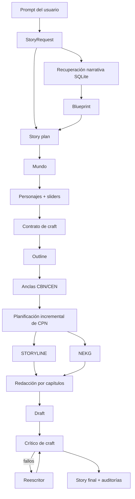

# Cómo se crea una historia en ASG Top-Down

> Actualización Top-Down 3.0.0 (16 de agosto de 2026). Esta sección describe la
> ruta vigente. El análisis 2.0.5 se conserva íntegro más abajo como registro
> histórico del diseño anterior; sus referencias a `StoryOrchestrator`, al DAG
> legado, `craft_contract.json` y craft dentro de nodos ya no son ejecutables.

## Flujo vigente en 3.0

`StoryGenerator` es ahora la única ruta de producción:

```text
request → catálogo SQLite → plan → mundo → personajes
        → premisa/sinopsis/capítulos → anclas CBN/CEN
        → CPN incremental revisado → STORYLINE + NEKG
        → tres variantes de craft → selección
        → escritura por capítulos → auditoría/reescritura → story.md
```

La separación principal es deliberada: STORYTELLER decide **qué sucede** y
craft decide **cómo se prepara y dramatiza**. `ChapterPlan`, `PlotNode`,
`PlotNodeProposal` y `PlotNodeReview` no contienen promesas, sliders, ciclos
try-fail ni IDs de craft. Ninguna decisión PPP puede aceptar, rechazar o alterar
un nodo.

### STORYTELLER y NEKG

1. El outline crea premisa, sinopsis y todos los capítulos, con presupuestos que
   suman exactamente la extensión solicitada.
2. Una sola generación produce exactamente un CBN y un CEN SVO por capítulo,
   considerando los abstracts adyacentes.
3. El CBN se acepta y se incorpora de inmediato a STORYLINE y NEKG.
4. Cada pseudo-CPN se propone desde CBN, CEN, CPN ya aceptados y conocimiento
   recuperado.
5. La revisión ve los ocho eventos recientes y hasta diez relaciones NEKG. Las
   relaciones dirigidas sujeto→objeto aparecen primero; después se añaden las
   incidentes, siempre por timestamp descendente dentro de cada grupo.
6. Causalidad, intención, conflicto, continuidad, novedad, avance hacia CEN y
   consistencia del mundo son bloqueantes. El revisor etiqueta además el foco de
   trabajo como lógica, redundancia, emoción, tema, resolución, lenguaje o
   misterio y puede devolver un reemplazo completo.
7. Solo el candidato final validado actualiza STORYLINE y NEKG. Todo rechazo y
   aceptación guarda `planning_checkpoint/storyline.json`, `nekg.json` y
   `node_reviews.json`.
8. El capítulo exige al menos un CPN y termina únicamente cuando el revisor
   confirma una conexión natural con CEN. El techo es
   `max(1, min(10, ceil(target_words / 350)))`; agotarlo produce
   `STORYLINE_PLANNING_FAILED` con los intentos auditables.
9. Finalmente se acepta CEN y se reparte el presupuesto entre CBN, CPN y CEN.

El backend NEKG vigente es local, en memoria, reconstruible desde JSON y no
necesita Neo4j. Conserva relaciones SVO y estados de ubicación, posesión,
conocimiento, situación y relación. Los candidatos rechazados nunca aparecen.

### Personajes y craft posterior

Cada protagonista tiene exactamente dos sliders iniciales altos (7–10) y uno
bajo (1–4) entre simpatía, competencia y proactividad. El bajo es siempre el
foco y asciende hasta 7–10; los dos altos permanecen altos.

Después de cerrar STORYLINE, `CraftVariantPlannerAgent` produce en una llamada
`variant-1`, `variant-2` y `variant-3`, con estrategias distintas. Cada una
incluye:

- una línea PPP maestra desde el primer hasta el último capítulo;
- cero, una o dos sublíneas globales completas;
- una línea PPP local por capítulo;
- hitos observables `start`, `transition` y `end` para cada protagonista;
- la cantidad adaptativa vigente de ciclos Yes-but/No-and y consecuencias
  persistentes.

Los validadores rechazan IDs `n_####` y los términos CBN/CPN/CEN en el craft.
`CraftVariantSelectorAgent` elige por constraints, ajuste causal, claridad de
progresión y arcos. El escritor recibe solo esa variante, la línea del capítulo
actual, los eventos aceptados y **el capítulo anterior completo**.

El auditor crea preguntas bloqueantes para PPP global/local, hitos, try-fail y
cada constraint explícito. Puede disparar hasta dos reescrituras. Si una etapa
tardía falla o agota intentos, se entrega la versión con menos fallos
bloqueantes y mejor ajuste de longitud, dejando warnings auditables.

### Variantes y compatibilidad

Cada plan autoritativo se guarda en:

```text
craft/selection.json
craft/variants/variant-N/plan.json
craft/variants/variant-N/global.json
craft/variants/variant-N/chapters/chapter-XXX.json
craft/variants/variant-N/chapters/chapter-XXX.md
craft/variants/variant-N/{draft,story}.md
craft/variants/variant-N/{craft_audit,craft_revision_history,length_audit,llm_usage}.json
```

La variante elegida se refleja también en los artefactos raíz compatibles. Para
redactar otra sin replanificar:

```python
alternate = generator.render_variant(run.run_dir, "variant-2")
```

Si ya existe su `story.md`, la operación no llama al modelo. Nunca modifica
`craft/selection.json` ni `run/story.md`. Los directorios de variante se pueden
comparar directamente con `compare-story-runs`.

Todos los system prompts, encabezados de contexto y feedback de reparación del
Top-Down activo están en inglés; UI, errores y ficción conservan el idioma del
usuario. `agents/__init__.py` exporta solo agentes activos. Los runs v2 completos
siguen entregándose, mientras que los parciales reinician desde `request.json`.

---

## Archivo histórico: implementación 2.0.5 (no vigente)

> Guía técnica, paso a paso, de la implementación actual (`asg-top-down` 2.0.5).
> Describe el flujo que ejecuta hoy `StoryGenerator`, las mejoras de personajes y
> de *promise–progress–payoff*, la construcción del NEKG, todos los agentes del
> paquete y los artefactos que quedan guardados.

## 1. Alcance y versión que describe este documento

Esta guía se basa en el estado actual de `main`, versión `2.0.5`, cuyo `HEAD` es
`6fbbcef` (16 de agosto de 2026). El punto de entrada del CLI es
`asg_top_down.cli:main`, y este crea un `StoryGenerator`. Por tanto, el flujo de
producción vigente es el definido en:

- `Models/Top-Down/src/asg_top_down/cli.py`
- `Models/Top-Down/src/asg_top_down/generator.py`
- `Models/Top-Down/src/asg_top_down/incremental.py`

El repositorio conserva además `StoryOrchestrator`, la implementación anterior.
Sigue siendo API pública por compatibilidad, pero **no es la ruta usada por el
comando `generate-story`**. Más adelante se separan con claridad los agentes
activos de los agentes que pertenecen principalmente a ese flujo legado.

## 2. Modelo mental: no hay un solo grafo

El sistema crea tres representaciones diferentes y complementarias:

| Representación | Archivo | Qué contiene | Para qué se usa |
|---|---|---|---|
| Outline | `outline.json` | Premisa, sinopsis, capítulos, presupuesto de palabras, fases de Freytag, beats de craft, hitos de personajes y ciclos try-fail | Define lo que debe ocurrir a alto nivel |
| STORYLINE | `storyline.json` | Eventos SVO CBN/CPN/CEN y enlaces causales entre eventos | Define el orden causal aceptado de los acontecimientos |
| NEKG | `nekg.json` | Entidades, relaciones SVO y último estado conocido de cada entidad | Mantiene continuidad factual mientras se planifican nuevos eventos |

Un CBN es el nodo de comienzo de capítulo (*Chapter Begin Node*), un CPN es un
nodo de progreso (*Chapter Progress Node*) y un CEN es el nodo de cierre
(*Chapter End Node*).



## 3. Cómo se inicia una generación

### 3.1. Desde el CLI

El script instalado es:

```toml
generate-story = "asg_top_down.cli:main"
```

`cli.main()` hace lo siguiente:

1. Reconfigura `stdout` y `stderr` como UTF-8 en Windows.
2. Pide un prompt no vacío.
3. Ejecuta `load_settings()`.
4. Construye `GeminiProvider` con modelo, límites de cuota y modelo de embeddings.
5. Construye `StoryGenerator` con las rutas y límites de reintentos.
6. Llama `StoryGenerator.run(prompt, on_progress=...)`.
7. Imprime la ruta de `story.md` o un error público sanitizado.

### 3.2. Desde Python

```python
from pathlib import Path
from asg_top_down import StoryGenerator
from asg_top_down.provider import GeminiProvider

provider = GeminiProvider(
    api_key="...",
    model_name="gemini-2.5-flash",
)
generator = StoryGenerator(provider, Path("Stories/Top-Down"))
run = generator.generate("Escribe una historia de misterio de 1800 palabras...")
print(run.story_path)
```

`run()` es solamente un alias de compatibilidad de `generate()`. Ambos ejecutan
el mismo flujo.

### 3.3. Configuración que cambia el comportamiento

| Variable | Valor por defecto | Efecto |
|---|---:|---|
| `GEMINI_API_KEY` | obligatorio | Credencial del proveedor |
| `GEMINI_MODEL` | `gemini-2.5-flash` | Modelo de generación |
| `GEMINI_EMBEDDING_MODEL` | `gemini-embedding-2` | Modelo de recuperación semántica |
| `STORY_DEFAULT_WORDS` | `1500` | Extensión usada si el prompt no dice otra |
| `STORY_MAX_CPN_RETRIES` | `2` | Reintentos adicionales por CPN; hay 3 intentos totales por defecto |
| `STORY_MAX_ARTIFACT_RETRIES` | `2` | Reparaciones adicionales de artefactos; hay 3 intentos totales por defecto |
| `GEMINI_RPM_LIMIT` | `15` | Solicitudes por minuto |
| `GEMINI_RPM_RESERVE` | `1` | Margen que se resta al límite RPM |
| `GEMINI_TPM_LIMIT` | `0` | Límite de tokens por minuto; `0` lo desactiva |
| `GEMINI_MAX_RETRIES` | `3` | Reintentos de transporte/cuota después de la petición inicial |
| `GEMINI_MAX_RETRY_DELAY` | `120` | Máxima espera aceptada para un reintento |

`StoryGenerator` también acepta `max_craft_revisions`, cuyo valor por defecto es
`2`. No existe una variable de entorno para este valor en el CLI actual; se
cambia desde Python.

## 4. Flujo completo, paso a paso

### Paso 1. Convertir el prompt en requisitos estructurados

**Responsable:** `AnalystAgent.run()`.

Si `generate()` recibe texto, el analista pide a Gemini un `StoryRequest` con:

- `original_prompt`
- `title`
- `language`
- `genre`
- `tone`
- `target_words`
- `premise`
- `constraints`

Después de la respuesta del modelo, el código vuelve a buscar localmente una
cantidad explícita mediante la expresión regular
`número + palabras|palabra|words|word`. Si existe, reemplaza el valor sugerido
por Gemini. Si no existe, fuerza `default_target_words`. Así la longitud no queda
a interpretación del modelo.

Pydantic exige entre 300 y 20 000 palabras. El progreso comienza en 0 % con la
etapa `analysis`.

### Paso 2. Crear el directorio auditable de la ejecución

**Responsable:** `ArtifactRepository.__init__()`.

El nombre sigue esta forma:

```text
Stories/Top-Down/YYYYMMDD-HHMMSS-titulo-normalizado/
```

`slugify()` elimina diacríticos, pasa a minúsculas, sustituye caracteres no
alfanuméricos por guiones y limita el título a 60 caracteres. Si ya existe una
ruta igual, agrega `-2`, `-3`, etc.

En este momento se crea `metadata.json` con estado `running`, modelo, fechas,
ID de ejecución, etapas completadas, errores y advertencias. También se guarda
`request.json`.

### Paso 3. Reconstruir y consultar el catálogo narrativo

**Responsable:** `NarrativeSchemaRepository`.

#### 3.1. Inicialización de SQLite

La base por defecto es `.cache/narrative-schemas.sqlite3`. `_initialize()`:

1. Crea `schema_migration` si no existe.
2. Ordena los `.sql` de `schema_db/migrations/`.
3. Ejecuta cada migración todavía no registrada.
4. Carga `schema_db/seeds/catalog.json` mediante `_seed()`.

Las tablas son:

- `catalog_entry`: macrotramas, situaciones, arcos, beats, géneros y roles.
- `beat`: datos estructurados del beat —función, participantes, precondiciones,
  efectos, cambio emocional, tensión, variantes y transiciones—.
- `embedding_cache`: vectores por hash de modelo y contenido.
- `catalog_fts`: índice virtual FTS5 para búsqueda textual/BM25.

La semilla se inserta con *upsert*, por lo que la base es reproducible y los
cambios del catálogo actualizan registros existentes.

#### 3.2. Construcción de la consulta

`retrieve()` concatena:

```text
original_prompt + premise + genre + tone
```

#### 3.3. Puntuación léxica

Se usan dos señales:

1. `_lexical()`: proporción acotada de tokens del prompt presentes en el texto
   de recuperación del registro.
2. `_fts_scores()`: consulta FTS5 con los tokens unidos por `OR`; convierte la
   puntuación BM25 negativa de SQLite a una fuerza normalizada entre 0 y 1.

Para cada entrada se conserva el máximo de ambas señales.

#### 3.4. Puntuación semántica

`_document_vectors()` calcula un SHA-256 de:

```text
modelo_de_embedding + NUL + texto_del_documento
```

Si el hash está en `embedding_cache`, reutiliza el vector. Si falta, llama
`provider.embed_documents()`. La consulta se vectoriza con
`provider.embed_query()`. La similitud es coseno, acotada a valores no negativos.

La fusión final es:

```text
score = 0.4 * lexical + 0.6 * semantic
```

Si embeddings falla, el sistema no aborta: continúa con FTS/BM25 y marca
`used_embeddings = false`.

#### 3.5. Selección diversificada

Por defecto recupera:

- 2 macrotramas
- 2 situaciones
- 2 arcos de personaje
- 8 beats
- 2 géneros
- 4 roles

Ordena por score descendente y luego por ID para desempatar. Evita seleccionar
variantes compatibles casi duplicadas cuando hay suficientes candidatos.

Los resultados forman `NarrativeBlueprint`, guardado en `blueprint.json`; la
consulta, modelo, uso de embeddings y selecciones quedan también en
`retrieval_trace.json`.

### Paso 4. Crear el plan causal de la historia

**Responsable lógico:** `StoryGenerator._plan()`.

Aunque existe un `PlannerAgent` legado, el generador actual llama directamente
`provider.generate_structured(..., schema=StoryPlanArtifact)`.

El prompt exige que objetivo, creencia equivocada o convicción, oposición
activa, elecciones irreversibles, clímax y final constituyan un solo argumento
causal. El resultado contiene:

- `logline`
- `theme`
- `central_conflict`
- `progression`, con al menos tres elementos
- `intended_ending`
- `archetypes`: uno primario y hasta dos secundarios

`_validate_plan()` comprueba que todos los IDs elegidos procedan exactamente de
las macrotramas, situaciones o arcos recuperados. No permite IDs inventados.

Si falla esta regla, `_validated_artifact()` guarda el candidato y el error en:

```text
artifact_attempts/story_plan/attempt-NNN.json
artifact_attempts/story_plan/attempt-NNN-validation.json
```

Luego vuelve a llamar al modelo con el candidato completo y el error, pidiendo
un reemplazo completo, no un parche. Al agotar los intentos produce
`ARTIFACT_VALIDATION_FAILED`.

### Paso 5. Construir un mundo funcional

**Responsable lógico:** `StoryGenerator._world()`.

Gemini devuelve un `WorldArtifact`:

- `setting`
- `time_period`
- `rules`
- `locations`
- `atmosphere`

La instrucción central es que cada regla y lugar debe limitar una decisión,
crear una oportunidad o causar una consecuencia. El sistema intenta evitar
*lore* puramente decorativo. Se guarda como `world.json`.

Esta etapa tiene validación de esquema, pero en el flujo actual no pasa por la
reparación semántica cruzada de `_validated_artifact()`.

### Paso 6. Diseñar los personajes y sus sliders

**Responsable lógico:** `StoryGenerator._characters()`.

El modelo recibe requisitos, plan, mundo y roles recuperados. Debe producir un
reparto compacto donde:

- cada acción importante se explique por una intención;
- la oposición tenga un objetivo activo e incompatible;
- `jungian_archetype` use un ID de rol recuperado;
- exista al menos un personaje `main`;
- cada personaje principal tenga un `slider_arc` completo.

Cada `Character` posee nombre, rol narrativo, arquetipo, objetivo, motivación,
conflicto, descripción del arco, importancia y slider opcional.

Para un personaje principal, `CharacterSliderArc` contiene tres escalas de 1 a
10:

- `sympathy`: simpatía percibida por el lector;
- `competence`: competencia demostrada;
- `proactivity`: capacidad de tomar iniciativa.

Cada escala tiene `start`, `target` y `rationale`. Además se elige:

- `focus`: la escala que realmente cambia;
- `direction`: `ascending` o `descending`;
- `justification`: por qué ese cambio forma un arco.

El validador Pydantic `focus_matches_direction()` exige que el slider focal sí
cambie y que la dirección coincida con los números. Por ejemplo, un arco
ascendente de proactividad no puede pasar de 8 a 3.

La instrucción pide IDs de rol recuperados, pero en esta ruta la validación
determinista posterior comprueba sliders y presencia del reparto principal, no
vuelve a contrastar `jungian_archetype` contra `blueprint.roles`. Esa
comprobación explícita sí existe en el `CharacterDesignerAgent` legado.

`validate_craft_characters()` añade dos reglas de producción:

1. debe existir al menos un personaje principal;
2. todos los principales deben tener `slider_arc`.

Los candidatos inválidos entran en el mismo ciclo de reparación auditable que
el plan. El resultado válido se guarda en `characters.json`.

### Paso 7. Crear el contrato de craft

**Responsable:** `CraftContractAgent.run()`.

El contrato se crea **antes** del outline para que la estructura no pueda
inventar retrospectivamente sus promesas. Debe contener:

1. exactamente una promesa de tono;
2. exactamente una promesa de trama principal;
3. exactamente una promesa por cada personaje principal.

Cada `CraftPromise` tiene:

- `id`
- `kind`: `tone`, `plot` o `character`
- `character_name`, solo para promesas de personaje
- `statement`: qué se promete
- `setup`: cómo se plantea
- `progress_signals`: una o más señales observables de avance
- `payoff`: pago concreto

El contrato incluye `try_fail_target`, calculado localmente mediante:

```python
max(2, min(7, ceil(target_words / 2000)))
```

Consecuencias de la fórmula:

| Palabras | Ciclos exigidos |
|---:|---:|
| 300 | 2 |
| 4 000 | 2 |
| 4 001 | 3 |
| 20 000 | 7 |

`validate_craft_contract()` verifica que el número sea exacto, que no se repita
un personaje y que el conjunto de promesas de personaje coincida exactamente
con el reparto principal. El artefacto válido es `craft_contract.json`.

### Paso 8. Construir el outline con promise–progress–payoff

**Responsable:** `IncrementalPlotPlanner.outline()`.

El modelo recibe request, plan, blueprint, personajes y contrato. Produce una
premisa, una sinopsis y una lista ordenada de `ChapterPlan`.

Cada capítulo contiene:

- ID, orden, título y resumen;
- `target_words`;
- fases de Freytag;
- `craft_beats`;
- `character_milestones`;
- `try_fail_cycles`.

#### 8.1. Beats de promesa

Por cada promesa debe haber:

- exactamente un `CraftBeat(kind="setup")`;
- uno o más `CraftBeat(kind="progress")`;
- exactamente un `CraftBeat(kind="payoff")`.

Cada beat tiene ID único, `promise_id` y descripción. La validación comprueba:

1. IDs globalmente únicos.
2. Referencias a promesas existentes.
3. Un solo setup y payoff, y al menos un progreso.
4. Orden de capítulos `setup <= progress <= payoff`.
5. Las promesas de tono y trama se plantean en el primer capítulo.

En este nivel se permite que setup, progreso y payoff compartan capítulo. La
validación posterior de STORYLINE exige que sus **nodos** sí estén en orden
estricto.

#### 8.2. Hitos del arco de personaje

Cada personaje principal debe tener exactamente:

- un hito `start`;
- un hito `transition`;
- un hito `end`.

Todos usan el `focus_slider` declarado por el personaje. El valor de `start`
debe ser idéntico al inicio del slider y el de `end` a su objetivo. Sus capítulos
deben mantener el orden start–transition–end. Personajes secundarios no pueden
recibir estos hitos.

#### 8.3. Ciclos Yes-but / No-and

El outline debe contener exactamente `try_fail_target` ciclos. Cada uno define:

- `action`: intento concreto;
- `outcome`: `yes_but` o `no_and`;
- `consequence`: coste persistente;
- `promise_id`: promesa que hace avanzar.

No basta con que el modelo entregue la cantidad: el planificador incremental
obliga a que los CPN los consuman y la STORYLINE comprueba que la consecuencia
aparezca como efecto y tenga un nodo causal posterior.

#### 8.4. Presupuesto de palabras

La suma exacta de `chapter.target_words` debe ser igual a
`request.target_words`. Si cualquier regla falla, se conserva el candidato y se
solicita una reparación completa. El resultado es `outline.json`.

### Paso 9. Crear las anclas de los capítulos

**Responsable:** `IncrementalPlotPlanner.anchors()`.

El modelo crea exactamente un evento inicial y uno final por capítulo, ambos en
forma sujeto–verbo–objeto:

```json
{
  "chapter_id": "chap_1",
  "begin_subject": "Ada",
  "begin_verb": "descubre",
  "begin_object": "la señal",
  "end_subject": "Ada",
  "end_verb": "oculta",
  "end_object": "la copia"
}
```

El inicio debe materializar beats `setup` e hitos `start`; el final, beats
`payoff` e hitos `end`. `_validate_anchors()` comprueba IDs únicos y
correspondencia exacta, uno a uno, con los capítulos del outline.

El artefacto queda en `chapter_anchors.json`.

### Paso 10. Inicializar la planificación incremental

**Responsable:** `IncrementalPlotPlanner.plan()`.

Se crean tres estados vacíos:

- `StorylineState`: capítulos, nodos aceptados y enlaces causales.
- `NarrativeEntityGraph`: entidades y relaciones aceptadas.
- `NodeReviewHistory`: nodos aceptados y todos los rechazos.

Los nodos se numeran globalmente `n_0001`, `n_0002`, etc. `global_order` empieza
en 1 y `timestamp` en 0.

Para cada capítulo se calcula el presupuesto de CPN:

```python
max(1, min(6, ceil(chapter.target_words / 450)))
```

Luego se eleva, si hace falta, hasta el número de ciclos try-fail del capítulo.
Así un capítulo de 1 500 palabras normalmente recibe cuatro CPN, y nunca más de
seis salvo que la cantidad de ciclos del propio outline obligue a ello.

La cuota orientativa por nodo es:

```text
chapter.target_words // (cantidad_de_CPN + 2)
```

El `+2` representa CBN y CEN. El resto de la división se asigna al CEN.

### Paso 11. Crear y aceptar el CBN

El CBN se construye localmente a partir del ancla inicial; no pasa por la
revisión de CPN. Recibe:

- todos los beats `setup` de ese capítulo;
- todos los hitos `start` de ese capítulo;
- ningún ciclo try-fail.

Si no es el primer capítulo, se crea un enlace `enables` desde el último nodo
del capítulo anterior. `StorylineState.accept()` exige que el ID sea nuevo y
que cada enlace nuevo vaya desde historia conocida hacia el nodo recién
aceptado.

Después se llama `nekg.apply(begin)` y se guarda un checkpoint.

### Paso 12. Proponer, revisar y aceptar cada CPN

Este es el bucle central de STORYTELLER.

#### 12.1. Separar requisitos ya consumidos

Antes del primer CPN quedan como pendientes solamente:

- beats `progress`;
- hitos `transition`;
- ciclos try-fail.

Setup/start ya pertenecen al CBN. Payoff/end están reservados para el CEN. Esta
separación es esencial para la mejora 2.0.5.

#### 12.2. Crear el scope autoritativo de craft

`_craft_scope()` genera:

```json
{
  "remaining_slots": 2,
  "available_craft_beat_ids": ["plot-progress-2"],
  "available_character_milestone_ids": ["ada-transition"],
  "available_try_fail_cycle_ids": ["tf-2"],
  "remaining_craft_beats": [],
  "remaining_character_milestones": [],
  "remaining_try_fail_cycles": []
}
```

Las tres listas de objetos completas sí llevan sus valores reales; se han
abreviado aquí para destacar la forma. Este scope, calculado por Python, es la
autoridad sobre qué IDs puede reclamar el siguiente candidato.

#### 12.3. Generar una propuesta

`_proposal()` pide un único `PlotNodeProposal` SVO. El prompt incluye:

- contexto narrativo del capítulo sin listas de craft reservadas;
- ancla final;
- número de slot y presupuesto;
- últimos ocho nodos aceptados;
- NEKG completo actual;
- requisitos de craft todavía disponibles;
- blueprint recuperado;
- feedback del intento anterior.

La propuesta debe tener causalidad, intención, oposición, cambio de estado y
avance hacia el final sin alcanzarlo prematuramente. Sus campos son:

- sujeto, verbo y objeto;
- propósito y beat de esquema;
- precondiciones y efectos;
- intención y conflicto;
- si alcanza el final;
- `state_changes`;
- IDs de beats, hitos y ciclos que afirma realizar;
- resultado try-fail opcional.

#### 12.4. Validación local previa a la crítica

`_proposal_craft_issues()` rechaza antes de llamar al revisor si:

- repite IDs;
- usa IDs no disponibles o ya consumidos;
- reclama más de un ciclo try-fail;
- quedan tantos ciclos como slots y el slot no consume uno;
- el resultado no coincide con `yes_but`/`no_and` planeado;
- da un resultado try-fail sin referenciar un ciclo;
- en el último slot no consume todos los requisitos restantes.

Si falla, el intento se guarda con etapa `proposal_validation`; no se desperdicia
una llamada de revisión.

#### 12.5. Revisión semántica del candidato

`_review()` envía la propuesta, el contexto narrativo, el final, el scope de
craft, los nodos recientes y las relaciones NEKG relacionadas con sujeto/objeto.

Aunque el texto del prompt dice “seven checks”, el esquema actual contiene diez
booleanos y la aceptación efectiva exige los diez:

1. `causal`
2. `intentional`
3. `conflict_present`
4. `continuous`
5. `novel`
6. `advances_ending`
7. `world_consistent`
8. `craft_coverage`
9. `consequence_persists`
10. `try_fail_valid`

El revisor puede entregar `revised`, un reemplazo completo de la propuesta. Si
existe, ese reemplazo —no la propuesta original— es el candidato final.

El validador `PlotNodeReview.acceptance_is_earned()` corrige una contradicción
en la que `accepted=true` pero algún check es falso: cambia `accepted` a falso y
registra los checks fallidos.

#### 12.6. Adjudicación determinista de cobertura

Después de la opinión de Gemini, Python vuelve a validar los IDs del candidato
final. `_adjudicate_craft_review()` hace que esa decisión local sea autoritativa:

- si Python encuentra IDs inválidos, fuerza `craft_coverage=false` y
  `accepted=false`;
- si Python demuestra que la cobertura es válida pero Gemini dijo que no, cambia
  `craft_coverage=true`;
- solo promueve a aceptado cuando **todos los demás nueve checks semánticos ya
  eran verdaderos**.

Así Gemini sigue juzgando causalidad, intención, conflicto, continuidad,
novedad, progreso, mundo y consecuencias, pero no puede inventar IDs pendientes
que el scope local declara inexistentes.

#### 12.7. Aceptación transaccional

Si la revisión es aceptada y no hay problemas locales:

1. `_node()` convierte la propuesta en `PlotNode`.
2. Agrega como `effects` la consecuencia exacta de cada ciclo try-fail.
3. Crea un enlace `causes` desde el nodo anterior.
4. `StorylineState.accept()` agrega nodo y enlace.
5. `nekg.apply(node, candidate.state_changes)` actualiza relaciones y estados.
6. Se registra `AcceptedNodeRecord` con nodo, cambios, revisión e intento.
7. Se eliminan de las listas pendientes los IDs reclamados.
8. Se guarda un checkpoint.

La aceptación es transaccional en el sentido de que el estado STORYLINE/NEKG no
cambia hasta que propuesta, revisión y reglas deterministas pasan.

#### 12.8. Rechazo y reintento aislado

Un rechazo conserva:

- capítulo, slot e intento;
- etapa: `proposal`, `proposal_validation`, `review` o `candidate_validation`;
- propuesta original;
- revisión;
- candidato final y si vino de `proposal` o `review.revised`;
- scope autoritativo;
- problemas y errores de esquema sanitizados.

El texto de los problemas se usa como `revision feedback` del siguiente intento.
Solo se reintenta ese CPN; los nodos anteriores permanecen aceptados.

Con `max_cpn_retries=2` hay tres intentos totales. Si se agotan, se lanza
`STORYLINE_PLANNING_FAILED` y los checkpoints permiten inspeccionar exactamente
qué pasó.

### Paso 13. Crear y aceptar el CEN

Cuando todos los CPN del capítulo han sido aceptados, el código comprueba que no
quede ningún progreso, transición o ciclo pendiente. Si queda uno, aborta la
planificación: no lo oculta ni lo asigna artificialmente al final.

El CEN se construye desde el ancla final y recibe:

- todos los beats `payoff` del capítulo;
- todos los hitos `end` del capítulo;
- ningún ciclo try-fail.

Se enlaza mediante `causes` desde el último CPN, se aplica al NEKG y se guarda
otro checkpoint.

### Paso 14. Validar la STORYLINE completa

Al terminar todos los capítulos, `validate_storyline_craft()` comprueba:

1. Que cada beat, hito y ciclo conocido aparezca exactamente una vez.
2. Que no aparezcan IDs desconocidos.
3. Que, para cada promesa, todos los nodos de progreso estén estrictamente entre
   el nodo de setup y el nodo de payoff.
4. Que cada ciclo use el resultado planeado.
5. Que su consecuencia exacta esté en `node.effects`.
6. Que el nodo del ciclo tenga una arista causal saliente, demostrando que la
   consecuencia afecta un evento posterior.

El resultado se guarda en `storyline.json`, `nekg.json` y `node_reviews.json`.
Durante el proceso, las versiones parciales viven en:

```text
planning_checkpoint/storyline.json
planning_checkpoint/nekg.json
planning_checkpoint/node_reviews.json
```

### Paso 15. Redactar cada capítulo

**Responsable lógico:** `StoryGenerator._write_chapter()`.

Para cada capítulo, el generador reconstruye un `writing_nekg` local y le aplica
los nodos aceptados de ese capítulo junto con los `state_changes` guardados en
las revisiones. Después envía a Gemini:

- request, plan, mundo, personajes y contrato;
- capítulo;
- nodos del capítulo;
- enlaces cuyo origen o destino toca esos nodos;
- NEKG acumulado;
- los últimos 6 000 caracteres del texto anterior.

La instrucción exige dramatizar todos los eventos aceptados, promesas, hitos y
consecuencias mediante acciones observables, sin revelar IDs, nombres de sliders
ni puntuaciones.

Detalle importante de implementación: como la llamada genera un capítulo
completo, el código aplica al `writing_nekg` todos los nodos de ese capítulo
**antes** de redactarlo. Por ello el contexto incluye el estado final conocido
del capítulo, no una actualización frase a frase dentro de la generación.

Gemini devuelve solo el cuerpo. `_canonical_chapter()` elimina un posible
encabezado inicial que el modelo haya añadido y antepone exactamente:

```markdown
## Título canónico
```

Cada texto va a `chapters/chapter-NNN.md`. Al unirlos se crea `draft.md`.

### Paso 16. Auditar el borrador con preguntas concretas

**Responsable:** `CraftCriticAgent.run()`.

`audit_questions()` genera una batería determinista; el modelo no decide qué
preguntas evaluar.

Por cada promesa pregunta:

- si está planteada;
- si progresa visiblemente;
- si tiene pago;
- si el pago es sorprendente pero merecido —esta última es consultiva—.

Por cada personaje principal pregunta:

- si la conducta establece el estado inicial;
- si existe transición observable;
- si el cambio afecta decisiones importantes;
- si la conducta final demuestra el estado objetivo sin explicar números.

Por cada ciclo try-fail pregunta:

- si el intento se dramatiza;
- si produce el Yes-but o No-and planeado;
- si el coste persiste y escala eventos posteriores.

También pregunta por causalidad global, progreso del medio y ausencia de
andamiaje de planificación en la ficción.

Cada respuesta tiene veredicto, evidencia, problema e instrucción de revisión.
Un fallo debe ser accionable. `normalize_audit()` restaura los metadatos
autoritativos de cada pregunta y convierte toda respuesta omitida en fallo
bloqueante; Gemini no puede aprobar el texto omitiendo preguntas difíciles.

### Paso 17. Reescribir y elegir la mejor versión

**Responsable:** `CraftRewriterAgent.run()` y
`StoryGenerator._review_draft()`.

El intento 0 es el draft. Si la auditoría tiene fallos bloqueantes o está fuera
del rango de longitud, el reescritor recibe solo las respuestas fallidas,
ordenando primero las bloqueantes. Debe:

- reescribir la historia completa;
- conservar hechos y dependencias causales;
- mostrar los cambios mediante acción y elección;
- ocultar IDs y terminología de planificación;
- preservar exactamente los encabezados canónicos;
- obedecer una corrección de longitud si hace falta.

La preservación de encabezados se exige en el prompt, pero la versión reescrita
no pasa por un comparador local de títulos ni por `_canonical_chapter()` otra
vez. Si el modelo desobedeciera esa instrucción, la auditoría de craft podría
detectarlo indirectamente, pero no existe hoy una validación determinista
específica para los headings después de una reescritura.

Hay hasta dos reescrituras por defecto, por lo que pueden existir los intentos
0, 1 y 2. Cada texto y auditoría se guarda bajo `craft_revisions/`.

La versión elegida minimiza, en este orden:

1. número de fallos bloqueantes;
2. distancia al rango de longitud;
3. cantidad de fallos consultivos;
4. en empate, prefiere el intento más reciente.

Esto significa que el último texto no se acepta automáticamente: se selecciona
la mejor versión auditada.

Si el crítico o reescritor falla después de existir un draft, se entrega la
mejor versión disponible, se crea `quality_warning.json` y la advertencia entra
en `metadata.json`. La planificación estricta no se relaja.

### Paso 18. Auditoría de longitud y cierre

La tolerancia final es:

```text
mínimo = ceil(target_words * 0.90)
máximo = floor(target_words * 1.20)
```

`length_audit.json` registra objetivo, límites, total real y cumplimiento. En el
generador actual la lista de auditorías por capítulo queda vacía; se audita el
total final. `_word_count()` usa `text.split()`, por lo que cuenta tokens
separados por espacios e incluye los marcadores/títulos Markdown presentes.

También se crean:

- `craft_revision_history.json`
- `craft_audit.json`
- `diagnostic_audit.json`, una vista sin puntuaciones numéricas
- plantilla de evaluación de `asg_evaluation`
- `llm_usage.json` y `llm_usage_summary.json`
- `story.md`

Finalmente se marcan `quality_review` y `story` como completadas, el metadata
pasa a `completed` y el progreso llega a 100 %.

## 5. Cómo se implementó la mejora de personajes

La mejora no consiste solamente en agregar más descripción al prompt. Está
implementada en cuatro niveles que se comprueban entre sí.

### Nivel 1. Esquema rígido

`CharacterSliderArc` obliga a declarar las tres dimensiones, un foco, dirección
y justificación. Los valores son enteros de 1 a 10 y el foco debe cambiar en la
dirección declarada.

### Nivel 2. Correspondencia con el contrato

`validate_craft_contract()` exige exactamente una promesa de personaje para
cada personaje principal, sin faltantes, extras ni duplicados.

### Nivel 3. Movimiento planificado y enlazado a eventos

El outline exige tres hitos por principal. Durante la STORYLINE:

- `start` se asigna al CBN;
- `transition` se debe consumir en un CPN;
- `end` se asigna al CEN.

Cada hito queda enlazado a un `PlotNode.character_milestone_ids`. No es una nota
flotante: tiene una ubicación causal concreta.

### Nivel 4. Comprobación en la prosa

El escritor recibe los hitos y debe dramatizarlos sin decir “proactividad 3” o
“slider de competencia”. El crítico revisa conducta inicial, transición,
decisiones consecuenciales y conducta final. El reescritor recibe instrucciones
específicas si alguno falla.

### Qué garantiza y qué no garantiza

El sistema garantiza estructuralmente que el arco esté planeado, ordenado,
asignado exactamente una vez y auditado. La calidad literaria de la
dramatización sigue dependiendo del modelo y de la auditoría semántica; los
números no miden psicológicamente al personaje ni se muestran al lector.

De forma parecida, `progress_signals` describe qué debería contar como progreso,
pero Python no compara lingüísticamente cada descripción de `CraftBeat` con esas
frases. Garantiza referencia, cardinalidad y orden; la correspondencia de
significado la juzgan el modelo planificador y el crítico final sobre la prosa.

## 6. Cómo se implementó promise–progress–payoff

La cadena completa es:

```text
CraftPromise
  -> CraftBeat setup/progress/payoff en el outline
  -> ID asignado a un CBN/CPN/CEN
  -> dramatización en el capítulo
  -> pregunta con evidencia en craft_audit.json
  -> posible instrucción de reescritura
```

### Reglas deterministas principales

1. Hay una promesa de tono, una de trama y una por protagonista.
2. Toda promesa tiene exactamente un setup, al menos un progreso y un payoff.
3. Tono y trama se plantean en el primer capítulo.
4. Setup y start se reservan al CBN.
5. Progreso, transición y try-fail se reservan a CPN.
6. Payoff y end se reservan al CEN.
7. Cada ID aparece una sola vez en la STORYLINE.
8. Los nodos de progreso están estrictamente entre setup y payoff.
9. Cada intento fallido deja una consecuencia persistente y un enlace futuro.
10. La prosa debe demostrar la promesa; poseer el ID no basta para aprobar la
    auditoría final.

### Últimas actualizaciones, versión por versión

#### 2.0.1 — contrato Sanderson y ciclo crítico–reescritor

- Se añadieron `CraftPromise`, `CraftContractArtifact`, `CraftBeat`,
  `CharacterMilestone`, `TryFailCycle` y los campos correspondientes en nodos.
- Se incorporaron sliders de simpatía, competencia y proactividad.
- Se añadió el objetivo try-fail proporcional a la longitud.
- Se crearon `CraftContractAgent`, `CraftCriticAgent` y
  `CraftRewriterAgent`.
- Se añadió la selección de la mejor versión después de hasta dos reescrituras.

#### 2.0.2 — respuestas contradictorias e inválidas recuperables

- Una revisión estructurada inválida consume un intento de CPN, no destruye la
  ejecución completa inmediatamente.
- El proveedor reintenta una vez las respuestas incompatibles con Pydantic y
  devuelve errores sanitizados de ubicación/tipo.
- `PlotNodeReview` normaliza `accepted=true` cuando hay checks falsos.

#### 2.0.3 — los IDs consumidos dejan de estar disponibles

- Después de aceptar un CPN, sus beats, hitos y ciclos se eliminan de las listas
  restantes.
- Propuesta y revisión reciben el scope autoritativo.
- Los rechazos distinguen propuesta original, revisión y candidato revisado.

#### 2.0.4 — reparación semántica y resiliencia de artefactos

- Plan, personajes, contrato, outline y anclas se reparan con errores cruzados
  deterministas.
- Cada candidato inválido queda en `artifact_attempts/`.
- Se restauraron checkpoints, telemetría, auditoría de longitud y entrega de la
  mejor historia cuando falla la revisión final.

#### 2.0.5 — adjudicación determinista del scope de craft

- `_chapter_narrative_context()` excluye `craft_beats`,
  `character_milestones` y `try_fail_cycles` al presentar el contexto general
  del capítulo al proponente/revisor.
- Setup/start ya consumidos y payoff/end reservados no aparecen como pendientes
  de un CPN.
- `_craft_scope()` presenta exclusivamente IDs disponibles.
- `_proposal_craft_issues()` decide localmente la validez de esos IDs.
- `_adjudicate_craft_review()` corrige únicamente el flag redundante de
  cobertura de Gemini; no sustituye sus comprobaciones semánticas.
- La prueba de regresión reproduce un revisor que inventa beats pendientes con
  scope vacío y comprueba que un CPN válido no sea rechazado.

## 7. Cómo se crea el NEKG, sin omitir pasos

NEKG significa **Narrative Entity Knowledge Graph**. Su implementación está en
`nekg.py` y es deliberadamente local, pequeña y auditable.

### 7.1. Estructuras almacenadas

`NarrativeEntity`:

```json
{
  "id": "ada",
  "name": "Ada",
  "kinds": [],
  "state": {
    "knowledge": "conoce la verdad",
    "location": "observatorio"
  },
  "last_event_id": "n_0004"
}
```

`EntityRelation`:

```json
{
  "source": "ada",
  "verb": "descubre",
  "target": "la_senal",
  "plot_node_id": "n_0002",
  "timestamp": 1
}
```

El artefacto final contiene dos listas: `entities` y `relations`.

### 7.2. Normalización de claves con `_key()`

Para convertir un nombre narrativo en ID:

1. `casefold()` hace comparación de mayúsculas/minúsculas robusta.
2. Unicode NFKD separa letras y diacríticos.
3. La codificación ASCII elimina diacríticos.
4. Todo grupo no alfanumérico se convierte en `_`.
5. Se quitan `_` iniciales/finales.
6. Si queda vacío, se usa `entity`.

Ejemplos:

```text
"Áda Vélez"       -> "ada_velez"
"La señal orbital" -> "la_senal_orbital"
```

Esto puede fusionar nombres que solo se distinguen por acentos o puntuación; es
una decisión de la implementación actual.

### 7.3. Agregar una relación con `add_node()`

Dado un `PlotNode`:

1. Normaliza `node.subject` y `node.object`.
2. Crea la entidad origen si no existe.
3. Crea la entidad destino si no existe.
4. Construye la relación SVO con verbo, ID de nodo y timestamp.
5. Solo la agrega si una relación completamente igual no está ya en la lista.

Si el objeto del nodo venía vacío, `PlotNode.normalize_sv()` lo sustituye por el
sujeto antes de llegar al NEKG.

### 7.4. Aplicar estados con `apply()`

`apply(node, state_changes)` llama primero `add_node()`. Después, por cada
`EntityStateChange`:

1. normaliza el nombre de la entidad;
2. la crea si todavía no existe;
3. escribe `entity.state[attribute] = value`;
4. actualiza `last_event_id` al nodo actual.

Los únicos atributos permitidos son:

- `location`
- `possession`
- `knowledge`
- `status`
- `relationship`

La escritura es “último valor gana”: un cambio posterior del mismo atributo
reemplaza el valor anterior. No hay historial de estados dentro de la entidad;
el historial reconstruible está en nodos/revisiones y relaciones.

Al final también actualiza `last_event_id` para sujeto y objeto, aunque no hayan
tenido un `state_change` explícito.

### 7.5. Cuándo se actualiza durante la planificación

- Al aceptar CBN: `nekg.apply(begin)`; agrega la relación, sin cambios de estado.
- Al aceptar CPN: `nekg.apply(node, candidate.state_changes)`; agrega relación y
  estados explícitos.
- Al aceptar CEN: `nekg.apply(end)`; agrega la relación, sin cambios de estado.
- Al rechazar un candidato: no se toca el NEKG.

Por eso el grafo representa solo hechos aceptados.

### 7.6. Cómo influye en el siguiente CPN

El proponente recibe `self.nekg.artifact()` completo. El revisor recibe
`nekg.related(subject, object)`:

1. busca relaciones que toquen al sujeto o al objeto;
2. si hay objeto, pone primero las relaciones exactas entre ese par;
3. ordena por timestamp descendente;
4. devuelve como máximo diez.

Esto permite detectar contradicciones como que alguien use un objeto perdido,
desconozca información ya aprendida o aparezca en un lugar incompatible. La
decisión de continuidad sigue siendo semántica del revisor; el NEKG aporta los
hechos, pero no ejecuta un motor lógico de precondiciones.

### 7.7. Ejemplo completo

Propuesta aceptada:

```json
{
  "subject": "Ada",
  "verb": "copia",
  "object": "la señal",
  "state_changes": [
    {"entity": "Ada", "attribute": "knowledge", "value": "verdad de la señal"},
    {"entity": "Ada", "attribute": "possession", "value": "copia cifrada"}
  ]
}
```

Resultado conceptual:

```text
(ada)-[copia, n_0003, t=2]->(la_senal)
ada.state.knowledge = "verdad de la señal"
ada.state.possession = "copia cifrada"
ada.last_event_id = "n_0003"
la_senal.last_event_id = "n_0003"
```

En el próximo CPN, propuesta y revisión conocen esos valores.

### 7.8. Limitaciones actuales del NEKG

- `kinds` existe en el esquema, pero `add_node()` no lo llena.
- No hay borrado ni valores múltiples para un mismo atributo.
- No hay inferencia automática ni ejecución determinista de precondiciones.
- No resuelve correferencias como “Ada”, “ella” y “la cartógrafa”.
- `relationship` es un valor de estado textual, distinto de las relaciones SVO.
- El flujo v2 guarda `nekg.json`, pero no genera una vista Mermaid específica
  del NEKG.
- CBN y CEN no llevan cambios de estado generados por el modelo en la
  implementación actual; solo los CPN aportan `state_changes` explícitos.
- `nekg.json` se cierra después de planificar la STORYLINE; no se vuelve a
  extraer información de la prosa ni se modifica a partir de `draft.md`.
- Pydantic limita el nombre del atributo de estado, pero no demuestra que el
  valor propuesto sea consecuencia lógica de `preconditions` y `effects`; esa
  coherencia pertenece a la revisión semántica.

## 8. Qué hace cada agente

### 8.1. Infraestructura común

`Agent[T]` es una clase abstracta genérica. Guarda `provider` y exige un método
`run()`. `json_text()` convierte modelos Pydantic o listas a JSON UTF-8 legible.

No todos los roles actuales son subclases de `Agent`: varias etapas viven como
métodos de `StoryGenerator` o `IncrementalPlotPlanner`.

### 8.2. Agentes activos en `StoryGenerator`

| Agente/rol | Implementación | Entrada | Salida | Función |
|---|---|---|---|---|
| Analista | `AnalystAgent.run()` | Prompt libre | `StoryRequest` | Extrae requisitos y fija extensión explícita |
| Planificador causal | `StoryGenerator._plan()` | Request + blueprint | `StoryPlanArtifact` | Diseña conflicto, progresión, final y composición de arquetipos |
| Constructor de mundo | `StoryGenerator._world()` | Request + plan | `WorldArtifact` | Crea reglas y lugares con consecuencias |
| Diseñador de personajes | `StoryGenerator._characters()` | Request + plan + mundo + roles | `CharactersArtifact` | Crea reparto, objetivos, oposición y sliders |
| Diseñador de craft | `CraftContractAgent.run()` | Request + plan + mundo + personajes | `CraftContractArtifact` | Define promesas y objetivo try-fail |
| Diseñador de outline | `IncrementalPlotPlanner.outline()` | Request + plan + blueprint + craft + personajes | `StoryOutlineArtifact` | Distribuye capítulos, beats, hitos y ciclos |
| Diseñador de anclas | `IncrementalPlotPlanner.anchors()` | Outline + mundo + personajes | `ChapterAnchorsArtifact` | Define CBN/CEN SVO |
| Proponente CPN | `IncrementalPlotPlanner._proposal()` | Estado aceptado + NEKG + scope | `PlotNodeProposal` | Propone un evento causal aislado |
| Revisor CPN | `IncrementalPlotPlanner._review()` | Propuesta + contexto + hechos | `PlotNodeReview` | Evalúa diez condiciones y puede reemplazar la propuesta |
| Adjudicador local | `_proposal_craft_issues()` + `_adjudicate_craft_review()` | Candidato + scope + revisión | Decisión corregida | Impone IDs y cobertura de forma determinista |
| Escritor de capítulo | `StoryGenerator._write_chapter()` | Todos los artefactos narrativos | Markdown | Dramatiza los eventos sin mostrar andamiaje |
| Crítico de craft | `CraftCriticAgent.run()` | Draft + preguntas + planificación | `CraftAuditArtifact` | Busca evidencia real en la ficción |
| Reescritor | `CraftRewriterAgent.run()` | Historia + fallos | Historia completa revisada | Repara fallos sin cambiar hechos ni encabezados |

### 8.3. Agentes conservados para `StoryOrchestrator` legado

| Clase | Qué hace | Diferencia frente al flujo actual |
|---|---|---|
| `PlannerAgent` | Recupera taxonomías JSON antiguas y crea el plan | V2 actual usa SQLite/blueprint y `_plan()` |
| `WorldBuilderAgent` | Crea el mundo | Función equivalente trasladada a `_world()` |
| `CharacterDesignerAgent` | Crea personajes y valida roles del catálogo | No incorpora por sí solo el contrato de sliders de producción actual |
| `DirectorAgent` | Genera de una vez capítulos, nodos y aristas candidatas | V2 propone y revisa cada CPN incrementalmente |
| `DramaAgent` | Audita cinco fases de Freytag en grafo o texto | El generador actual conserva fases en el outline, pero no llama este agente |
| `SceneWriterAgent` | Escribe un capítulo desde un `StorylineArtifact` | V2 usa `_write_chapter()` con craft y NEKG v2 |
| `ChapterComplianceAgent` | Verifica nodos y goals de un capítulo | No participa en la ruta `StoryGenerator` actual |
| `CriticAgent` | Da puntuaciones numéricas de coherencia, estilo, etc. | V2 reemplazó puntuaciones por preguntas diagnósticas de craft |
| `EditorAgent` | Reescribe una vez desde una crítica general | V2 usa hasta dos pasadas de `CraftRewriterAgent` y elige la mejor |

`StoryOrchestrator` instancia y usa esos agentes, mantiene un procesador DAG
`StorylineGraphProcessor`, hasta cinco replanificaciones globales, auditorías de
Freytag y compliance de capítulos. Es importante no atribuir ese comportamiento
al `StoryGenerator`: son dos rutas distintas que coexisten por compatibilidad.

## 9. Funciones deterministas más importantes

| Función | Responsabilidad |
|---|---|
| `StoryGenerator._validated_artifact()` | Ejecutar generación, validación cruzada, persistencia del fallo y reparación completa |
| `validate_craft_characters()` | Exigir principales y sliders |
| `validate_craft_contract()` | Exigir objetivo try-fail y promesas exactas por reparto |
| `validate_craft_outline()` | Validar beats, orden, hitos, valores y ciclos |
| `validate_storyline_craft()` | Verificar cobertura única, orden causal y persistencia |
| `IncrementalPlotPlanner.cpn_budget()` | Decidir cantidad base de CPN por extensión |
| `StorylineState.accept()` | Agregar solo un nodo nuevo enlazado desde historia conocida |
| `_proposal_craft_issues()` | Validar localmente IDs y reglas de slot |
| `_adjudicate_craft_review()` | Hacer autoritativa la cobertura local sin anular semántica |
| `NarrativeEntityGraph.add_node()` | Agregar entidades y relación SVO |
| `NarrativeEntityGraph.apply()` | Aplicar relación y cambios de estado |
| `NarrativeEntityGraph.related()` | Recuperar relaciones recientes relevantes |
| `audit_questions()` | Crear la batería exacta de preguntas finales |
| `normalize_audit()` | Impedir omisiones y restaurar campos autoritativos |
| `diagnostic_from_craft()` | Convertir fallos a diagnóstico no numérico |
| `_length_bounds()` | Calcular rango final de −10 %/+20 % |
| `_canonical_chapter()` | Normalizar un único encabezado por capítulo |

## 10. Proveedor, esquemas y reintentos

`GeminiProvider.generate_structured()` solicita `application/json` y entrega el
schema Pydantic a Gemini. Aun así, valida de nuevo localmente.

Si Pydantic falla:

1. extrae solo ubicación y tipo de error, sin incluir contenido sensible;
2. agrega una instrucción de corrección al prompt original;
3. pide un reemplazo completo;
4. por defecto lo intenta una vez más;
5. si vuelve a fallar, lanza `StructuredResponseError`.

Esto es distinto de los reintentos semánticos de `_validated_artifact()` y de
los reintentos por CPN. Una sola tentativa semántica puede contener hasta dos
llamadas estructuradas por errores de schema.

Para errores 408, 429 o 5xx, `_generate()` respeta la espera sugerida y reintenta
hasta el límite configurado. Las cuotas permanentes diarias/de facturación se
clasifican por separado. Nunca se exponen la API key ni el prompt dentro del
error público.

Cada respuesta registra operación, modelo, tiempo, tokens de prompt, candidatos,
razonamiento, caché, total, reintentos y segundos de espera.

## 11. Artefactos de una ejecución completa

| Ruta | Contenido |
|---|---|
| `metadata.json` | Estado, modelo, etapas, errores y warnings |
| `request.json` | Requisitos normalizados |
| `blueprint.json` | Conocimiento narrativo recuperado |
| `retrieval_trace.json` | Consulta, scores y modo de recuperación |
| `story_plan.json` | Plan causal |
| `world.json` | Mundo funcional |
| `characters.json` | Reparto y sliders |
| `craft_contract.json` | Promesas y objetivo try-fail |
| `outline.json` | Capítulos y asignaciones de craft |
| `chapter_anchors.json` | Anclas SVO de inicio/final |
| `planning_checkpoint/*` | Estado parcial después de cada aceptación/rechazo |
| `storyline.json` | Nodos y aristas aceptadas |
| `nekg.json` | Entidades, estados y relaciones |
| `node_reviews.json` | Historial completo de CPN |
| `chapters/*.md` | Capítulos iniciales |
| `draft.md` | Unión de capítulos |
| `craft_revisions/*` | Cada versión y su auditoría |
| `craft_revision_history.json` | Intentos y versión seleccionada |
| `craft_audit.json` | Auditoría de la versión elegida |
| `diagnostic_audit.json` | Diagnóstico agregado sin notas |
| `length_audit.json` | Extensión final y tolerancia |
| `quality_warning.json` | Fallos no bloqueantes de entrega, si existen |
| `llm_usage*.json` | Telemetría de llamadas |
| `error_report.json` | Error seguro y accionable, solo si falla |
| `story.md` | Historia final entregada |

Los artefactos se escriben inmediatamente después de cada etapa; un fallo no
borra el trabajo previo.

## 12. Errores y recuperación

### Artefacto estructural inválido

Se guarda en `artifact_attempts/`, se pide reemplazo y, si se agota el límite,
se genera `ARTIFACT_VALIDATION_FAILED` con etapa y reglas incumplidas.

### CPN inválido

Se registra el intento, se mantiene intacto el estado aceptado y se reintenta el
slot. Al agotarse: `STORYLINE_PLANNING_FAILED`.

### Fallo del crítico o reescritor final

Como ya existe una historia completa, el sistema termina con la mejor versión y
una advertencia. No convierte un problema de auditoría tardía en pérdida total.

### `resume()`

Si existe `story.md`, devuelve inmediatamente esa ejecución. Si la ejecución es
parcial, lee `request.json` y crea una ejecución nueva. Los checkpoints de la
ejecución fallida quedan para auditoría, pero el generador v2 todavía no retoma
una etapa intermedia dentro del mismo directorio.

## 13. Pruebas que respaldan estas reglas

Las pruebas relevantes están en:

- `Models/Top-Down/tests/test_craft.py`
- `Models/Top-Down/tests/test_storyteller_v2.py`
- `Models/Top-Down/tests/test_nekg.py`

Cubren, entre otros casos:

- dirección y cambio obligatorio del slider focal;
- personaje principal sin slider;
- promesa faltante de un principal;
- referencia a promesa desconocida;
- respuesta omitida por el crítico convertida en fallo;
- review contradictoria normalizada;
- IDs setup/payoff fuera del scope de CPN;
- propuesta o revisión que intenta reutilizar IDs consumidos;
- reparación de plan, personajes, contrato, outline y anclas;
- fallback a FTS cuando embeddings está fuera de línea;
- actualización de conocimiento en NEKG;
- consecuencias try-fail presentes y con salida causal;
- selección de la mejor versión después de 0, 1 o 2 reescrituras;
- entrega con warning si crítico o reescritor falla;
- checkpoints y error accionable al agotar revisiones CPN.

## 14. Índice rápido del código fuente

- [Flujo principal](../Models/Top-Down/src/asg_top_down/generator.py)
- [Planificación incremental](../Models/Top-Down/src/asg_top_down/incremental.py)
- [Reglas de craft](../Models/Top-Down/src/asg_top_down/craft.py)
- [Esquemas Pydantic](../Models/Top-Down/src/asg_top_down/schemas.py)
- [NEKG](../Models/Top-Down/src/asg_top_down/nekg.py)
- [Recuperación SQLite](../Models/Top-Down/src/asg_top_down/narrative_db.py)
- [Agentes](../Models/Top-Down/src/asg_top_down/agents/)
- [Proveedor Gemini](../Models/Top-Down/src/asg_top_down/provider.py)
- [Persistencia](../Models/Top-Down/src/asg_top_down/storage.py)
- [Errores públicos](../Models/Top-Down/src/asg_top_down/errors.py)
- [Configuración](../Models/Top-Down/src/asg_top_down/config.py)
- [Flujo legado](../Models/Top-Down/src/asg_top_down/orchestrator.py)
- [DAG legado y Mermaid](../Models/Top-Down/src/asg_top_down/graph.py)
- [Migraciones y semillas](../Models/Top-Down/schema_db/)

## 15. Resumen operativo en pseudocódigo

```python
request = analyze(prompt)
repo = create_run(request.title)

blueprint = narrative_db.retrieve(request)
plan = generate_validate_repair_plan(request, blueprint)
world = generate_world(request, plan)
characters = generate_validate_repair_characters(request, plan, world, blueprint)
craft = generate_validate_repair_contract(request, plan, world, characters)
outline = generate_validate_repair_outline(request, plan, blueprint, craft, characters)
anchors = generate_validate_repair_anchors(outline, world, characters)

storyline = empty_storyline(outline.chapters)
nekg = empty_nekg()

for chapter in outline.chapters:
    begin = make_CBN(chapter.anchor.begin, chapter.setup_beats, chapter.start_milestones)
    accept(storyline, begin)
    nekg.apply(begin)

    for slot in chapter.cpn_budget:
        remaining = deterministic_craft_scope(chapter, accepted_nodes)
        for attempt in allowed_attempts:
            proposal = propose_CPN(storyline.recent, nekg, remaining)
            reject_if_ids_are_invalid(proposal, remaining)
            review = review_final_candidate(proposal, storyline.recent, nekg, remaining)
            candidate = review.revised or proposal
            review = adjudicate_local_craft_coverage(review, candidate, remaining)
            if review.accepted:
                accept(storyline, candidate)
                nekg.apply(candidate, candidate.state_changes)
                consume_claimed_ids(remaining, candidate)
                checkpoint()
                break
        else:
            fail_storyline()

    require_no_remaining_progress_milestones_or_cycles()
    end = make_CEN(chapter.anchor.end, chapter.payoff_beats, chapter.end_milestones)
    accept(storyline, end)
    nekg.apply(end)

validate_every_craft_id_once_and_in_order(storyline, outline)

draft = join(write_each_chapter(storyline, nekg, craft, characters))
versions = audit_and_rewrite_up_to_two_times(draft)
story = choose_fewest_blocking_failures_then_best_length(versions)
save_all_artifacts_and_complete(story)
```

La propiedad central del diseño es esta: **el modelo propone y evalúa significado,
pero Python decide estructura, IDs, orden, cardinalidad, consumo, persistencia y
trazabilidad**. Esa separación es lo que evita que una respuesta aparentemente
convincente rompa silenciosamente el contrato narrativo.
