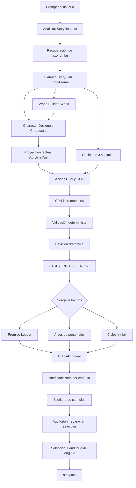
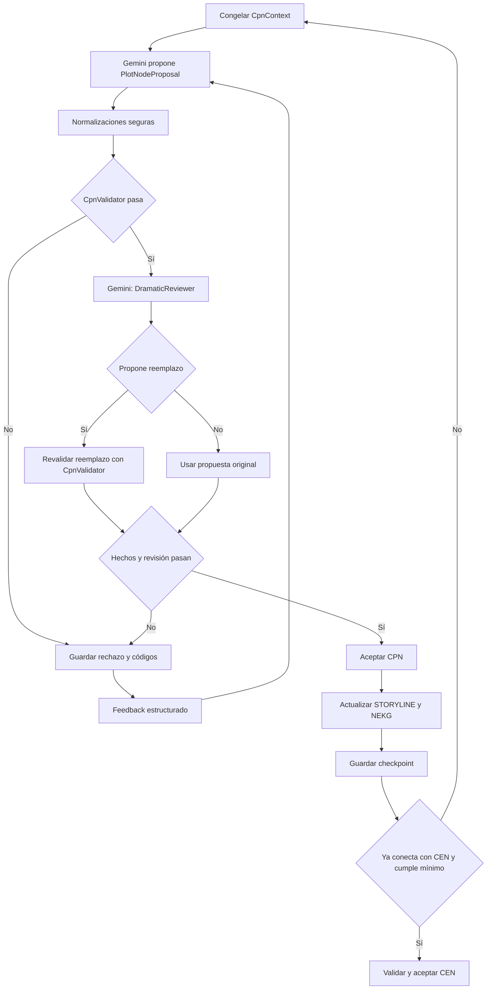

# Pipeline Top-Down 4.1 explicado mediante una ejecución real con Gemini

## 1. Propósito de este documento

Este documento explica, paso a paso y con evidencia de una ejecución real, cómo el sistema Top-Down 4.1 transforma una solicitud en lenguaje natural en una historia terminada. El caso de estudio es **La Gran Alianza de las Eras**, generada el 27 de agosto de 2026 mediante `gemini-3.5-flash-lite`.

La ejecución completa se encuentra en [`Stories/Top-Down/20260827-192648-la-gran-alianza-de-las-eras`](../Stories/Top-Down/20260827-192648-la-gran-alianza-de-las-eras/). El relato entregado está en [`story.md`](../Stories/Top-Down/20260827-192648-la-gran-alianza-de-las-eras/story.md).

El objetivo no es solamente enumerar archivos. Para cada etapa se explica:

- qué información recibe;
- qué agente o función interviene;
- qué transformación realiza;
- por qué esa transformación es necesaria;
- cómo se valida el resultado;
- qué ocurre cuando la validación falla;
- qué artefactos permiten comprobarlo;
- y cómo se manifestó en esta historia concreta.

### 1.1 Resultado resumido del caso

| Dato | Resultado observado | Evidencia |
| --- | --- | --- |
| Identificador del run | `20260827-192648-la-gran-alianza-de-las-eras` | [`metadata.json`](../Stories/Top-Down/20260827-192648-la-gran-alianza-de-las-eras/metadata.json) |
| Modelo generativo | `gemini-3.5-flash-lite` | [`metadata.json`](../Stories/Top-Down/20260827-192648-la-gran-alianza-de-las-eras/metadata.json) |
| Estado técnico | `completed` | [`metadata.json`](../Stories/Top-Down/20260827-192648-la-gran-alianza-de-las-eras/metadata.json) |
| Idioma | Español | [`request.json`](../Stories/Top-Down/20260827-192648-la-gran-alianza-de-las-eras/request.json) |
| Extensión solicitada | 1800 palabras | [`request.json`](../Stories/Top-Down/20260827-192648-la-gran-alianza-de-las-eras/request.json) |
| Capítulos solicitados y creados | 3 | [`request.json`](../Stories/Top-Down/20260827-192648-la-gran-alianza-de-las-eras/request.json), [`outline.json`](../Stories/Top-Down/20260827-192648-la-gran-alianza-de-las-eras/outline.json) |
| Nodos factuales | 12: 3 CBN, 6 CPN y 3 CEN | [`storyline.json`](../Stories/Top-Down/20260827-192648-la-gran-alianza-de-las-eras/storyline.json) |
| Aristas causales | 11 | [`storyline.json`](../Stories/Top-Down/20260827-192648-la-gran-alianza-de-las-eras/storyline.json) |
| Intentos CPN rechazados | 2, ambos reparados | [`node_reviews.json`](../Stories/Top-Down/20260827-192648-la-gran-alianza-de-las-eras/node_reviews.json) |
| Llamadas registradas | 37; ninguna llamada fallida | [`llm_usage.json`](../Stories/Top-Down/20260827-192648-la-gran-alianza-de-las-eras/llm_usage.json) |
| Tokens registrados | 321 226 | [`llm_usage.json`](../Stories/Top-Down/20260827-192648-la-gran-alianza-de-las-eras/llm_usage.json) |
| Artefactos en el directorio | 96 archivos | Directorio del run |
| Advertencia final | Reparaciones agotadas; se entregó la mejor versión auditada | [`quality_warning.json`](../Stories/Top-Down/20260827-192648-la-gran-alianza-de-las-eras/quality_warning.json) |

> **Resultado importante:** `completed` significa que todas las etapas del pipeline terminaron y existe una historia seleccionada. No significa que todos los criterios de calidad hayan pasado. La historia tiene 2465 palabras, por encima de la tolerancia máxima de 2160. Esta diferencia se explica en la sección 10.

## 2. Vista completa del pipeline



La decisión arquitectónica más importante es la frontera **STORYLINE congelada → craft**. Primero se establecen hechos comprobables: quién hizo qué, dónde, bajo qué condiciones y con qué efectos. Después se decide cómo dramatizar esos hechos. Una reparación de estilo o de arco no puede regenerar silenciosamente un CPN y cambiar la causalidad ya aceptada.

## 3. Ciclo interno de un CPN



Este ciclo combina dos clases de control:

1. **Control determinista:** reglas que el programa puede comprobar sin interpretación creativa, por ejemplo la existencia de una entidad, la ubicación de un objeto o la veracidad de una precondición.
2. **Control semántico y dramático:** valoración de causalidad, intención, conflicto, continuidad, novedad, avance hacia el final y eficacia emocional.

Gemini participa en la propuesta y la revisión, pero no tiene la última palabra sobre el estado factual. Toda propuesta —incluido un reemplazo sugerido por el revisor— debe superar las mismas validaciones deterministas.

## 4. Entrada, configuración y comunicación con Gemini

### 4.1 Prompt original

La entrada exacta se conserva en [`request.json`](../Stories/Top-Down/20260827-192648-la-gran-alianza-de-las-eras/request.json). Se solicitó una historia en español, de unas 1800 palabras y exactamente tres capítulos, sobre dinosaurios inteligentes que desarrollan tecnología adaptada a anatomías reales.

El comando público utilizado fue `generate-story`, ejecutado desde el entorno virtual del proyecto. La interfaz:

1. carga `.env`;
2. obtiene `GEMINI_API_KEY` y `GEMINI_MODEL`;
3. construye `GeminiProvider`;
4. construye `StoryGenerator`;
5. entrega el prompt a `StoryGenerator.run`;
6. publica el progreso y los artefactos creados.

La clave no se copia a ningún artefacto ni a este documento. Solamente el nombre del modelo queda registrado.

### 4.2 Por qué se usa salida estructurada

La mayor parte de los agentes no solicita texto libre, sino JSON compatible con modelos Pydantic concretos. Por ejemplo, el analista debe devolver `StoryRequest`, el mundo debe devolver `WorldArtifact` y cada propuesta de CPN debe devolver `PlotNodeProposal`.

Esto se hace porque una cadena de agentes necesita contratos estables. Si un agente escribiera una descripción libre, el siguiente tendría que adivinar dónde está el identificador de una localización, qué parte es una precondición o qué valor representa un efecto. Con un esquema:

- los campos obligatorios son explícitos;
- los tipos se verifican;
- las referencias pueden validarse;
- un error produce retroalimentación concreta;
- el artefacto puede persistirse y auditarse.

El proveedor configura `application/json` y el esquema esperado en la llamada a Gemini. Si la respuesta no valida, genera una nueva solicitud con las rutas y tipos de error. Las llamadas de prosa de los escritores y reescritores sí son texto libre.

### 4.3 Cuotas, reintentos y trazabilidad

El proveedor aplica un limitador de solicitudes por minuto, reintentos de transporte y perfiles de temperatura diferentes para extracción, planificación, propuestas, prosa, revisión y reescritura. Cada llamada produce un registro en [`llm_calls.jsonl`](../Stories/Top-Down/20260827-192648-la-gran-alianza-de-las-eras/llm_calls.jsonl), posteriormente resumido en [`llm_usage.json`](../Stories/Top-Down/20260827-192648-la-gran-alianza-de-las-eras/llm_usage.json).

En este run se registraron:

- 37 llamadas;
- 0 llamadas fallidas en el run;
- 321 226 tokens totales informados;
- 8 propuestas `PlotNodeProposal` para obtener 6 CPN aceptados;
- 6 revisiones `PlotNodeReview`, porque las 2 propuestas inválidas fueron rechazadas antes de gastar una revisión dramática;
- 3 auditorías de craft;
- 7 generaciones de texto: 3 capítulos y 4 reescrituras selectivas.

## 5. Etapa 1: análisis y normalización

### Entrada

El prompt original del usuario.

### Responsable

`AnalystAgent`.

### Transformación

El analista extrae una especificación `StoryRequest` que conserva el texto original y añade:

- `processed_prompt` en inglés para los agentes internos;
- título propuesto;
- idioma;
- género y tono;
- extensión objetivo;
- número de capítulos;
- premisa;
- restricciones explícitas.

### Por qué se hace

Un prompt humano mezcla contenido, preferencias y restricciones en una sola frase. Separarlo evita que cada agente interprete de forma distinta requisitos como “exactamente 3 capítulos” o “en español”. El texto enriquecido interno también ofrece vocabulario consistente a los agentes sin perder la solicitud original.

### Resultado del caso

[`request.json`](../Stories/Top-Down/20260827-192648-la-gran-alianza-de-las-eras/request.json) contiene:

```json
{
  "title": "La Gran Alianza de las Eras",
  "language": "Spanish",
  "target_words": 1800,
  "requested_chapters": 3
}
```

Entre las restricciones normalizadas aparecen escribir en español, usar tres capítulos, adaptar físicamente las tecnologías, incorporar datos paleontológicos y resolver el conflicto mediante cooperación.

### Validación

Antes de crear el resto del pipeline se comprueba que la cantidad de palabras permita distribuir los capítulos. Con 1800 palabras y 3 capítulos, el presupuesto es válido.

### Artefactos

- [`request.json`](../Stories/Top-Down/20260827-192648-la-gran-alianza-de-las-eras/request.json): solicitud normalizada y fuente de los requisitos.
- [`metadata.json`](../Stories/Top-Down/20260827-192648-la-gran-alianza-de-las-eras/metadata.json): registra que la etapa `analysis` terminó.

## 6. Etapa 2: recuperación y aplicación de taxonomías narrativas

### Entrada

`StoryRequest` y el catálogo local de taxonomías.

### Responsable

`NarrativeSchemaRepository`.

### Transformación

El repositorio busca esquemas narrativos pertinentes y construye un `NarrativeBlueprint`. La búsqueda combina la especificación procesada con evidencia del prompt y utiliza embeddings para ordenar candidatos. Después el planner selecciona convenciones concretas y se compila un brief reducido.

### Por qué se hace

La taxonomía no escribe la historia. Funciona como una biblioteca de patrones narrativos recuperables. Permite ofrecer al planificador opciones relevantes —promesas, roles, movimientos, complicaciones y conclusiones— sin introducir todo el catálogo en cada llamada.

El sistema exige evidencia del prompt para aplicar una taxonomía secundaria. Esta regla evita que Gemini añada géneros o estructuras no solicitadas simplemente porque parecen interesantes.

### Resultado del caso

La taxonomía primaria fue `first-contact`. No significa contacto con extraterrestres: el sistema interpretó el encuentro entre especies con anatomías y modelos técnicos radicalmente distintos como un encuentro con una alteridad significativa.

Se seleccionaron, entre otros:

- `move-signal`, `move-models` y `move-reciprocity`;
- el rol de intérprete y el de responsable político;
- la complicación `comp-frame-mismatch`;
- la conclusión `end-mutual-change`.

El primer `story_plan` fue rechazado porque intentó usar una taxonomía de acento sin evidencia explícita. El error se guardó en [`attempt-001-validation.json`](../Stories/Top-Down/20260827-192648-la-gran-alianza-de-las-eras/artifact_attempts/story_plan/attempt-001-validation.json); el valor fallido completo se conserva en [`attempt-001.json`](../Stories/Top-Down/20260827-192648-la-gran-alianza-de-las-eras/artifact_attempts/story_plan/attempt-001.json). Gemini recibió el error y produjo un plan corregido sin taxonomía de acento.

### Artefactos

- [`blueprint.json`](../Stories/Top-Down/20260827-192648-la-gran-alianza-de-las-eras/blueprint.json): opciones recuperadas y contexto narrativo disponible.
- [`retrieval_trace.json`](../Stories/Top-Down/20260827-192648-la-gran-alianza-de-las-eras/retrieval_trace.json): evidencia de la búsqueda y selección.
- [`taxonomy_application.json`](../Stories/Top-Down/20260827-192648-la-gran-alianza-de-las-eras/taxonomy_application.json): opciones que el planner decidió aplicar.
- [`taxonomy_brief.json`](../Stories/Top-Down/20260827-192648-la-gran-alianza-de-las-eras/taxonomy_brief.json): proyección compacta para agentes posteriores.

## 7. Etapa 3: plan, StoryFrame, mundo y personajes

### 7.1 Plan y StoryFrame

`PlannerAgent` convierte la solicitud y el blueprint en [`story_plan.json`](../Stories/Top-Down/20260827-192648-la-gran-alianza-de-las-eras/story_plan.json). Dentro de él, [`story_frame.json`](../Stories/Top-Down/20260827-192648-la-gran-alianza-de-las-eras/story_frame.json) fija la columna vertebral:

- pregunta central: si especies de anatomías radicalmente distintas pueden superar su incomprensión y salvar el mundo compartido;
- A-plot: diseñar y construir un sistema geotérmico de estabilización planetaria;
- B-plot: aprender a confiar e integrar las percepciones y fortalezas de otras especies;
- estado inicial: civilizaciones segregadas y recelosas;
- estado final: coalición global simbiótica;
- relación causal: aceptar la diferencia permite coordinar cuerpos distintos y resolver la crisis.

#### Por qué existe StoryFrame

La premisa por sí sola no indica qué cambio debe probar el final. `StoryFrame` une conflicto externo, necesidad interna y transformación final antes de inventar eventos. Así, los CPN no son episodios independientes: deben acercar una pregunta central a una respuesta observable.

### 7.2 Mundo

`WorldBuilderAgent` genera [`world.json`](../Stories/Top-Down/20260827-192648-la-gran-alianza-de-las-eras/world.json) con identificadores estables, reglas, localizaciones, conexiones y objetos.

En este caso las reglas principales son:

- la maquinaria pesada requiere la masa de un saurópodo;
- el ensamblaje delicado requiere la precisión de un troodóntido;
- los conductos geotérmicos deben anclarse con placas de armadura de anquilosaurio.

Las localizaciones canónicas son `basin-foundry`, `vent-control-hub` y `seismic-core`. Los objetos relevantes son `hydraulic-lever`, `calibration-rod` y `armor-shield`.

#### Por qué se usan identificadores

Los nombres literarios pueden variar: “núcleo”, “núcleo sísmico” o “cámara profunda”. Un identificador estable permite comprobar que una precondición se refiere exactamente a `seismic-core`. Los validadores trabajan con IDs; el escritor puede usar prosa natural.

### 7.3 Personajes y separación factual

`CharacterDesignerAgent` genera [`characters.json`](../Stories/Top-Down/20260827-192648-la-gran-alianza-de-las-eras/characters.json). Los personajes principales son:

- **Voss**, saurópodo asociado a masa, liderazgo y maquinaria pesada;
- **Tiri**, troodóntida de precisión e interpretación técnica;
- **Borma**, anquilosaurio cuya armadura sirve para resistir el entorno geotérmico.

El artefacto completo incluye deseos, necesidades, voz, relaciones y datos para arcos. Sin embargo, STORYLINE recibe una proyección `StorylineCast` sin sliders ni instrucciones de craft.

#### Por qué se elimina información antes de STORYLINE

Un slider de relación o una intención de payoff son decisiones dramáticas, no hechos físicos. Si el planificador factual los recibiera, podría cambiar un evento para satisfacer un arco todavía no congelado. La proyección mantiene únicamente lo necesario para comprobar presencia, vida, conocimiento y participación de los personajes.

## 8. Etapa 4: outline y anclas de capítulo

### 8.1 Outline

El planificador incremental crea [`outline.json`](../Stories/Top-Down/20260827-192648-la-gran-alianza-de-las-eras/outline.json). La historia quedó dividida en tres capítulos de 600 palabras objetivo:

| Capítulo | Función general | Presupuesto |
| --- | --- | ---: |
| `chap-1` — Las Vibraciones del Silencio | exposición y ascenso del conflicto | 600 |
| `chap-2` — El Colapso de los Modelos | ascenso y clímax | 600 |
| `chap-3` — La Gran Alianza de las Eras | descenso y desenlace | 600 |

El outline sigue siendo de alto nivel. Describe qué debe ocurrir en cada capítulo, pero todavía no fija todos los eventos causales.

### 8.2 Anclas CBN y CEN

[`chapter_anchors.json`](../Stories/Top-Down/20260827-192648-la-gran-alianza-de-las-eras/chapter_anchors.json) fija un evento inicial y uno final para cada capítulo:

| Capítulo | CBN previsto | CEN previsto |
| --- | --- | --- |
| `chap-1` | Voss inspecciona la palanca hidráulica en la fundición | Tiri analiza la varilla de calibración activa y aprende que la presión aumenta |
| `chap-2` | Tiri recupera la varilla | Borma asegura el escudo desplegado y queda defendiendo el conducto |
| `chap-3` | Borma posiciona el escudo | Voss activa la palanca en el núcleo y estabiliza la fundición |

#### Por qué se crean anclas

Sin un inicio y un destino verificables, la generación incremental no sabría cuándo un capítulo ha desarrollado suficiente causalidad. Las anclas convierten un resumen narrativo en dos estados concretos:

- **CBN:** estado factual desde el que parte el capítulo;
- **CEN:** estado factual que debe ser posible al terminar.

Los CPN se crean entre ambos. No deben ejecutar prematuramente el efecto final, sino construir sus precondiciones.

## 9. Etapa 5: STORYLINE factual, CBN, CPN, CEN, DAG y NEKG

## 9.1 Qué significan CBN, CPN y CEN

- **CBN — Chapter Begin Node:** nodo de inicio de capítulo. Establece o confirma las condiciones desde las que comienza el bloque.
- **CPN — Chapter Plot Node:** nodo interno de trama. Introduce una acción intencional, oposición, cambio observable y consecuencia causal.
- **CEN — Chapter End Node:** nodo de cierre de capítulo. Ejecuta el resultado anclado y cambia las condiciones del capítulo siguiente.

En [`storyline.json`](../Stories/Top-Down/20260827-192648-la-gran-alianza-de-las-eras/storyline.json), cada nodo contiene:

- identificador y capítulo;
- tipo de nodo;
- localización;
- sujeto, verbo y objeto;
- orden local y global;
- presupuesto de palabras;
- propósito y función narrativa;
- dependencias;
- precondiciones;
- efectos;
- intención, conflicto y consecuencia.

### 9.2 Por qué se crean CPN

Supongamos que el capítulo comienza con una varilla de calibración inactiva y debe terminar con Tiri descubriendo que la presión aumenta. Saltar directamente del inicio al descubrimiento produciría un resultado sin mecanismo causal.

Los CPN responden preguntas intermedias:

1. ¿Qué acción concreta realiza un personaje?
2. ¿Puede realizarla en su ubicación actual?
3. ¿Está disponible el objeto?
4. ¿Qué debe ser verdadero antes?
5. ¿Qué cambia después?
6. ¿Ese cambio es nuevo o repite otro evento?
7. ¿Prepara el CEN sin ejecutar su efecto antes de tiempo?

Por eso los CPN no son simplemente “escenas adicionales”. Son los puentes verificables entre el estado inicial y el estado final del capítulo.

### 9.3 Cantidad y presupuesto de CPN en este caso

Para cada capítulo, el mínimo es dos CPN porque su presupuesto es de 600 palabras y los capítulos de al menos 400 requieren dos. El máximo se calcula así:

```text
min(8, ceil(600 / 180)) = min(8, 4) = 4
```

Cada capítulo terminó al alcanzar la alineación con su CEN en el segundo CPN. Por tanto, no necesitó usar los cuatro espacios disponibles.

La distribución factual fue:

| Tipo | Porcentaje | Palabras por nodo | Cantidad por capítulo |
| --- | ---: | ---: | ---: |
| CBN | 15 % | 90 | 1 |
| CPN | 70 % total | 210 cada uno | 2 |
| CEN | 15 % | 90 | 1 |

La suma es `90 + 210 + 210 + 90 = 600`.

### 9.4 Qué recibe un CPN

Antes de solicitar una propuesta, `CpnContext` congela:

- el capítulo y sus anclas;
- reglas, mapa y objetos del mundo;
- elenco factual;
- StoryFrame;
- CPN ya aceptados del capítulo;
- últimos ocho eventos aceptados;
- snapshot actual del NEKG;
- IDs de nodos aceptados que pueden usarse como dependencias;
- firmas SVO prohibidas;
- puente de localización necesario para alcanzar el CEN;
- posición actual, mínimo y máximo de CPN;
- paleta taxonómica y movimientos seleccionados.

Congelar este contexto hace que todos los controles de un intento se refieran al mismo estado. Gemini no puede validar una propuesta contra una versión del mundo y después aplicar el resultado sobre otra.

### 9.5 SVO y repetición

SVO significa **Subject–Verb–Object**: sujeto, verbo y objeto. En el caso real:

```text
tiri — modulates — calibration-rod
```

La firma permite detectar duplicados aunque la explicación narrativa cambie. El conjunto prohibido incluye el CBN, el CEN y los CPN ya aceptados del capítulo. Esto evita que Gemini “repare” un error reescribiendo con sinónimos la misma acción causal.

### 9.6 Validación determinista

`DependencyValidator` y `CpnValidator` pueden rechazar, entre otras cosas:

- localizaciones o entidades desconocidas;
- incompatibilidad entre ID y tipo de entidad;
- acciones de personajes muertos;
- personaje u objeto ausente del lugar;
- objeto no disponible por ubicación o propietario;
- dependencia desconocida;
- precondición falsa;
- efecto sobre entidad desconocida;
- efectos contradictorios o que no cambian el estado;
- destino desconocido o movimiento no adyacente;
- SVO duplicado;
- referencia taxonómica inválida;
- efecto reservado para el CEN;
- intento de alinearse con el CEN antes del mínimo;
- falta de puente hacia el CEN al llegar al máximo.

Estas reglas existen porque un modelo de lenguaje puede producir una acción que suena convincente aunque contradiga el estado acumulado.

### 9.7 Revisión dramática

Una propuesta factualmente válida pasa a `DramaticReviewer`, que comprueba:

- causalidad;
- intención;
- presencia de conflicto;
- continuidad;
- novedad;
- avance hacia el final;
- consistencia con el mundo;
- efectividad emocional;
- alineación con el CEN.

El revisor puede aceptar, rechazar o devolver una propuesta revisada. Un reemplazo nunca se acepta directamente: vuelve a pasar por `CpnValidator`.

### 9.8 Caso real detallado: segundo CPN del capítulo 1

El primer CPN aceptado, `n_0002`, hizo que Tiri examinara la varilla y adquiriera el conocimiento `calibration_tolerance_low`. Su dependencia fue `n_0001`.

Para el segundo espacio, Gemini propuso inicialmente:

```text
tiri — analyzes — calibration-rod
efecto: tiri.knowledge = pressure_rising
```

La propuesta fue rechazada antes de la revisión dramática por dos razones:

1. `CEN_EFFECT_RESERVED`: intentaba producir `tiri.knowledge = pressure_rising`, exactamente el efecto reservado para el CEN.
2. `DUPLICATE_SVO`: repetía el SVO del ancla final, `tiri analyzes calibration-rod`.

La evidencia completa está en [`attempt-01-dependency.json`](../Stories/Top-Down/20260827-192648-la-gran-alianza-de-las-eras/storyline_attempts/chap-1/slot-02/attempt-01-dependency.json).

El sistema devolvió a Gemini códigos, mensajes y correcciones requeridas. En el segundo intento se obtuvo `n_0003`:

```json
{
  "id": "n_0003",
  "subject": { "id": "tiri" },
  "verb": "modulates",
  "object": { "id": "calibration-rod" },
  "depends_on_node_ids": ["n_0002"],
  "effects": [
    {
      "entity_id": "calibration-rod",
      "attribute": "status",
      "value": "active"
    }
  ]
}
```

Esta reparación es causalmente mejor: no descubre todavía la presión. Primero activa el instrumento. El revisor marcó como verdaderos los ocho controles dramáticos y `aligns_with_cen`; el registro aceptado se encuentra en [`node_reviews.json`](../Stories/Top-Down/20260827-192648-la-gran-alianza-de-las-eras/node_reviews.json).

Ahora sí el CEN `n_0004` puede verificar su precondición:

```text
calibration-rod.status == active
```

y producir el efecto final:

```text
tiri.knowledge = pressure_rising
```

La secuencia completa queda:

```text
n_0002: Tiri detecta tolerancia baja
    ↓
n_0003: Tiri modula la varilla y la deja activa
    ↓
n_0004: Tiri analiza la varilla activa y aprende que la presión aumenta
```

El conocimiento adquirido en `n_0004` reaparece como precondición del CEN final `n_0012`. De este modo, un hecho producido en el capítulo 1 sigue siendo verificable dos capítulos después.

### 9.9 Segundo rechazo observado

En `chap-3`, espacio 2, Gemini intentó repetir `voss transports hydraulic-lever`. `DUPLICATE_SVO` lo rechazó. El segundo intento cambió la acción a `voss relocates hydraulic-lever`, mantuvo la dependencia `n_0010` y completó el movimiento al núcleo. La propuesta fallida está en [`storyline_attempts/chap-3/slot-02/attempt-01-dependency.json`](../Stories/Top-Down/20260827-192648-la-gran-alianza-de-las-eras/storyline_attempts/chap-3/slot-02/attempt-01-dependency.json).

### 9.10 DAG causal

`storyline.json` conserva 11 `accepted_edges` y este orden topológico:

```text
n_0001 → n_0002 → n_0003 → n_0004
       → n_0005 → n_0006 → n_0007 → n_0008
       → n_0009 → n_0010 → n_0011 → n_0012
```

Cada dependencia apunta a un nodo aceptado con orden anterior. La verificación posterior no encontró referencias desconocidas ni ciclos.

El DAG responde “qué evento necesita a cuál”. No sustituye el NEKG: ambas representaciones contestan preguntas distintas.

### 9.11 NEKG

NEKG significa **Narrative Entity Knowledge Graph**. [`nekg.json`](../Stories/Top-Down/20260827-192648-la-gran-alianza-de-las-eras/nekg.json) conserva:

- entidades del mundo;
- estado actual de cada entidad;
- conocimiento adquirido por personajes;
- última acción que modificó cada entidad;
- relaciones SVO producidas por eventos.

Ejemplos del estado final:

- `hydraulic-lever.location = seismic-core`;
- `hydraulic-lever.status = operational`;
- `calibration-rod.status = active`;
- Tiri conoce `pressure_rising`;
- `basin-foundry.status = stabilized`.

El NEKG responde “qué es verdadero ahora”. Cada CPN consulta un snapshot antes de declarar precondiciones y, tras aceptarse, aplica sus efectos.

### 9.12 Checkpoints y transacciones

Se crearon 14 checkpoints en [`checkpoints/`](../Stories/Top-Down/20260827-192648-la-gran-alianza-de-las-eras/checkpoints/):

- 12 después de nodos aceptados;
- 2 adicionales después de intentos rechazados.

Cada checkpoint contiene `storyline.json`, `nekg.json` y `node_reviews.json`. El checkpoint final [`00014/storyline.json`](../Stories/Top-Down/20260827-192648-la-gran-alianza-de-las-eras/checkpoints/00014/storyline.json) y [`00014/nekg.json`](../Stories/Top-Down/20260827-192648-la-gran-alianza-de-las-eras/checkpoints/00014/nekg.json) tienen los mismos hashes que los artefactos finales.

Un capítulo se construye sobre copias temporales de STORYLINE y NEKG. Si sus CPN no consiguen conectar CBN y CEN:

1. se descarta la copia del capítulo;
2. se vuelve al prefijo aceptado anterior;
3. se regeneran una vez sus anclas usando un resumen de fallos;
4. se reintenta el capítulo;
5. los rechazos permanecen guardados.

En este run no fue necesario hacer rollback de un capítulo ni regenerar anclas. Hubo reintentos de espacios CPN dentro del mismo capítulo, que sí quedaron auditados.

## 10. Etapa 6: congelación de hechos y craft posterior

Después de aceptar los 12 nodos, el pipeline guarda [`storyline.json`](../Stories/Top-Down/20260827-192648-la-gran-alianza-de-las-eras/storyline.json), [`nekg.json`](../Stories/Top-Down/20260827-192648-la-gran-alianza-de-las-eras/nekg.json) y [`node_reviews.json`](../Stories/Top-Down/20260827-192648-la-gran-alianza-de-las-eras/node_reviews.json), y marca `storyline_frozen`.

El generador serializa la STORYLINE y cuenta las llamadas CPN antes de iniciar craft. Al final de la composición comprueba que:

- la serialización factual no cambió;
- no apareció ninguna llamada CPN nueva.

Si cualquiera cambia, falla la etapa de arquitectura.

### 10.1 Promise–Progress–Payoff

[`craft/promise_ledger.json`](../Stories/Top-Down/20260827-192648-la-gran-alianza-de-las-eras/craft/promise_ledger.json) contiene un contrato tonal y tres promesas:

- dirección de la historia;
- personaje y conflicto;
- estructura de género.

Cada promesa tiene apertura, progresos y un payoff. Esto se crea después de los hechos porque una promesa debe asignarse a eventos existentes, no obligar a regenerarlos.

### 10.2 Arcos de personaje

[`craft/character_arcs.json`](../Stories/Top-Down/20260827-192648-la-gran-alianza-de-las-eras/craft/character_arcs.json) planifica el arco de Voss mediante cuatro evidencias: establecimiento, presión, elección decisiva y consecuencia.

El arco convierte cambios factuales en significado personal. Por ejemplo, transportar y activar la maquinaria es factual; aceptar liderazgo compartido es la lectura dramática superpuesta.

### 10.3 Ciclos try-fail

[`craft/try_fail.json`](../Stories/Top-Down/20260827-192648-la-gran-alianza-de-las-eras/craft/try_fail.json) contiene tres ciclos. Un ciclo `yes_but` concede progreso con un costo; uno `no_and` niega el objetivo y agrava la situación. Se planifican sobre STORYLINE para modular tensión sin inventar hechos incompatibles.

### 10.4 Craft Alignment

[`craft/alignment.json`](../Stories/Top-Down/20260827-192648-la-gran-alianza-de-las-eras/craft/alignment.json) enlaza las acciones del ledger, arco y try-fail con nodos y capítulos concretos.

El primer intento omitió diez referencias requeridas y fue rechazado. El intento y su error se conservan en:

- [`artifact_attempts/craft_alignment/attempt-001.json`](../Stories/Top-Down/20260827-192648-la-gran-alianza-de-las-eras/artifact_attempts/craft_alignment/attempt-001.json);
- [`artifact_attempts/craft_alignment/attempt-001-validation.json`](../Stories/Top-Down/20260827-192648-la-gran-alianza-de-las-eras/artifact_attempts/craft_alignment/attempt-001-validation.json).

El segundo intento pasó. [`craft/plan.json`](../Stories/Top-Down/20260827-192648-la-gran-alianza-de-las-eras/craft/plan.json) reúne ledger, arcos, ciclos y alineación.

## 11. Etapa 7: vistas, briefs y escritura

### 11.1 ChapterCraftView

Cada capítulo recibe una vista derivada:

- [`chap-1.view.json`](../Stories/Top-Down/20260827-192648-la-gran-alianza-de-las-eras/craft/chapters/chap-1.view.json)
- [`chap-2.view.json`](../Stories/Top-Down/20260827-192648-la-gran-alianza-de-las-eras/craft/chapters/chap-2.view.json)
- [`chap-3.view.json`](../Stories/Top-Down/20260827-192648-la-gran-alianza-de-las-eras/craft/chapters/chap-3.view.json)

La vista evita entregar al escritor todo el plan global. Solo expone las acciones de craft pertinentes al capítulo.

### 11.2 Estado anterior y brief sanitizado

Antes de escribir cada capítulo, el generador reconstruye el NEKG y guarda el snapshot anterior:

- [`state-before-chap-1.json`](../Stories/Top-Down/20260827-192648-la-gran-alianza-de-las-eras/chapters/state-before-chap-1.json)
- [`state-before-chap-2.json`](../Stories/Top-Down/20260827-192648-la-gran-alianza-de-las-eras/chapters/state-before-chap-2.json)
- [`state-before-chap-3.json`](../Stories/Top-Down/20260827-192648-la-gran-alianza-de-las-eras/chapters/state-before-chap-3.json)

Después crea briefs sanitizados:

- [`chap-1.brief.json`](../Stories/Top-Down/20260827-192648-la-gran-alianza-de-las-eras/craft/chapters/chap-1.brief.json)
- [`chap-2.brief.json`](../Stories/Top-Down/20260827-192648-la-gran-alianza-de-las-eras/craft/chapters/chap-2.brief.json)
- [`chap-3.brief.json`](../Stories/Top-Down/20260827-192648-la-gran-alianza-de-las-eras/craft/chapters/chap-3.brief.json)

El brief contiene hechos a dramatizar, mutaciones previstas, directivas de escena, acciones de promesa pertinentes y tarjetas conductuales. Excluye IDs internos innecesarios, sliders crudos, taxonomías y payoffs futuros que podrían contaminar el capítulo.

### 11.3 Capítulos y borrador

`ChapterWriterAgent` escribe cada capítulo en español:

- [`chapter-001.md`](../Stories/Top-Down/20260827-192648-la-gran-alianza-de-las-eras/chapters/chapter-001.md)
- [`chapter-002.md`](../Stories/Top-Down/20260827-192648-la-gran-alianza-de-las-eras/chapters/chapter-002.md)
- [`chapter-003.md`](../Stories/Top-Down/20260827-192648-la-gran-alianza-de-las-eras/chapters/chapter-003.md)

Los capítulos normalizados se concatenan en [`draft.md`](../Stories/Top-Down/20260827-192648-la-gran-alianza-de-las-eras/draft.md).

## 12. Etapa 8: auditoría, reparación, longitud y selección final

### 12.1 Auditoría de craft

`CraftCriticAgent` responde preguntas concretas de coherencia, pacing, engagement, satisfacción, promesas, arcos y estructura. El resultado final está en [`craft_audit.json`](../Stories/Top-Down/20260827-192648-la-gran-alianza-de-las-eras/craft_audit.json).

En la auditoría seleccionada, las 22 respuestas tienen veredicto `pass`. Sin embargo, el crítico es otro modelo de lenguaje: su afirmación de que la longitud era correcta no sustituye el conteo determinista.

### 12.2 Reparación selectiva

El pipeline detectó que `chap-2` y `chap-3` estaban fuera de sus rangos y los envió al reescritor en dos rondas. Se conservaron tres versiones y sus auditorías en [`craft_revisions/`](../Stories/Top-Down/20260827-192648-la-gran-alianza-de-las-eras/craft_revisions/).

[`craft_revision_history.json`](../Stories/Top-Down/20260827-192648-la-gran-alianza-de-las-eras/craft_revision_history.json) muestra:

- intento 0: no pasó; capítulos 2 y 3 señalados;
- intento 1: no pasó; capítulos 2 y 3 señalados nuevamente;
- intento 2: no pasó; se agotó el máximo;
- versión seleccionada: intento 2.

Los hashes de las tres versiones son idénticos. Es decir, las reescrituras devolvieron el mismo contenido. El selector prefirió la última versión por su regla de desempate, pero no mejoró la longitud.

### 12.3 Auditoría de longitud

[`length_audit.json`](../Stories/Top-Down/20260827-192648-la-gran-alianza-de-las-eras/length_audit.json) aplica una tolerancia de 90 % a 120 %:

| Unidad | Objetivo | Rango permitido | Resultado | Pasa |
| --- | ---: | ---: | ---: | --- |
| `chap-1` | 600 | 540–720 | 657 | Sí |
| `chap-2` | 600 | 540–720 | 816 | No |
| `chap-3` | 600 | 540–720 | 992 | No |
| Total | 1800 | 1620–2160 | 2465 | **No** |

### 12.4 Por qué existe `story.md` aunque la longitud no pase

El pipeline considera la auditoría de longitud al elegir la mejor versión, pero al agotar el máximo de reparaciones entrega la mejor disponible y añade una advertencia. Por eso coexisten:

- `metadata.status = completed`;
- `story.md` existente;
- `craft_revision_history.exhausted = true`;
- `length_audit.total.within_tolerance = false`;
- [`quality_warning.json`](../Stories/Top-Down/20260827-192648-la-gran-alianza-de-las-eras/quality_warning.json).

Esto es preferible a ocultar el problema: la historia puede leerse y evaluarse, pero el consumidor sabe que necesita revisión humana si la extensión es un requisito estricto.

### 12.5 Resultado final y evaluación humana

- [`story.md`](../Stories/Top-Down/20260827-192648-la-gran-alianza-de-las-eras/story.md): historia seleccionada.
- [`evaluation.json`](../Stories/Top-Down/20260827-192648-la-gran-alianza-de-las-eras/evaluation.json): plantilla para evaluación humana posterior.

## 13. Persistencia, manifiesto y recuperación

`ArtifactRepository` escribe primero en un archivo temporal y después lo reemplaza de forma atómica. El objetivo es evitar que una interrupción deje un JSON a medio escribir.

[`metadata.json`](../Stories/Top-Down/20260827-192648-la-gran-alianza-de-las-eras/metadata.json) conserva estado, modelo, fechas, etapas completadas y advertencias. [`pipeline_manifest.json`](../Stories/Top-Down/20260827-192648-la-gran-alianza-de-las-eras/pipeline_manifest.json) registra versión, run, etapas y SHA-256/tamaño de 94 artefactos.

La comprobación posterior recalculó los 94 hashes y tamaños: no hubo diferencias. El manifiesto no se incluye a sí mismo y `evaluation.json` se crea mediante el módulo de evaluación fuera de `ArtifactRepository`; por eso existen 96 archivos físicos y 94 entradas en el manifiesto.

Los checkpoints permiten diagnosticar y preparan una recuperación futura. La versión 4.1 todavía no reanuda automáticamente un run incompleto: lo marca como pendiente de recuperación.

En esta ejecución no existe `error_report.json`, porque el run terminó. Tampoco se creó un directorio de run durante el fallo inicial de conectividad de la consola: ese fallo ocurrió antes de que el analista pudiera producir `StoryRequest` y, por tanto, antes de construir `ArtifactRepository`.

## 14. Catálogo de los 96 archivos creados

### 14.1 Raíz del run: 25 archivos

| Artefacto | Función |
| --- | --- |
| [`metadata.json`](../Stories/Top-Down/20260827-192648-la-gran-alianza-de-las-eras/metadata.json) | Estado, versión, modelo, etapas y advertencias. |
| [`pipeline_manifest.json`](../Stories/Top-Down/20260827-192648-la-gran-alianza-de-las-eras/pipeline_manifest.json) | Hash y tamaño de los artefactos administrados. |
| [`llm_calls.jsonl`](../Stories/Top-Down/20260827-192648-la-gran-alianza-de-las-eras/llm_calls.jsonl) | Registro append-only de llamadas. |
| [`llm_usage.json`](../Stories/Top-Down/20260827-192648-la-gran-alianza-de-las-eras/llm_usage.json) | Resumen de llamadas, tokens, esperas y fallos. |
| [`request.json`](../Stories/Top-Down/20260827-192648-la-gran-alianza-de-las-eras/request.json) | Solicitud original y normalizada. |
| [`blueprint.json`](../Stories/Top-Down/20260827-192648-la-gran-alianza-de-las-eras/blueprint.json) | Conocimiento narrativo recuperado. |
| [`retrieval_trace.json`](../Stories/Top-Down/20260827-192648-la-gran-alianza-de-las-eras/retrieval_trace.json) | Traza de recuperación. |
| [`story_plan.json`](../Stories/Top-Down/20260827-192648-la-gran-alianza-de-las-eras/story_plan.json) | Plan causal y aplicación taxonómica. |
| [`story_frame.json`](../Stories/Top-Down/20260827-192648-la-gran-alianza-de-las-eras/story_frame.json) | Pregunta, A-plot, B-plot y estados globales. |
| [`taxonomy_application.json`](../Stories/Top-Down/20260827-192648-la-gran-alianza-de-las-eras/taxonomy_application.json) | Opciones narrativas seleccionadas. |
| [`taxonomy_brief.json`](../Stories/Top-Down/20260827-192648-la-gran-alianza-de-las-eras/taxonomy_brief.json) | Paleta compacta y sanitizada. |
| [`world.json`](../Stories/Top-Down/20260827-192648-la-gran-alianza-de-las-eras/world.json) | Reglas, localizaciones y objetos. |
| [`characters.json`](../Stories/Top-Down/20260827-192648-la-gran-alianza-de-las-eras/characters.json) | Perfiles y relaciones. |
| [`outline.json`](../Stories/Top-Down/20260827-192648-la-gran-alianza-de-las-eras/outline.json) | Capítulos, fases y presupuestos. |
| [`chapter_anchors.json`](../Stories/Top-Down/20260827-192648-la-gran-alianza-de-las-eras/chapter_anchors.json) | CBN y CEN previstos. |
| [`storyline.json`](../Stories/Top-Down/20260827-192648-la-gran-alianza-de-las-eras/storyline.json) | Nodos, aristas y orden topológico congelados. |
| [`nekg.json`](../Stories/Top-Down/20260827-192648-la-gran-alianza-de-las-eras/nekg.json) | Estado final de entidades y relaciones. |
| [`node_reviews.json`](../Stories/Top-Down/20260827-192648-la-gran-alianza-de-las-eras/node_reviews.json) | 6 revisiones aceptadas y 2 rechazos. |
| [`draft.md`](../Stories/Top-Down/20260827-192648-la-gran-alianza-de-las-eras/draft.md) | Primer ensamblaje de capítulos. |
| [`craft_audit.json`](../Stories/Top-Down/20260827-192648-la-gran-alianza-de-las-eras/craft_audit.json) | Auditoría de la versión seleccionada. |
| [`craft_revision_history.json`](../Stories/Top-Down/20260827-192648-la-gran-alianza-de-las-eras/craft_revision_history.json) | Intentos, versión seleccionada y agotamiento. |
| [`length_audit.json`](../Stories/Top-Down/20260827-192648-la-gran-alianza-de-las-eras/length_audit.json) | Conteo determinista de palabras. |
| [`quality_warning.json`](../Stories/Top-Down/20260827-192648-la-gran-alianza-de-las-eras/quality_warning.json) | Advertencia por reparaciones agotadas. |
| [`evaluation.json`](../Stories/Top-Down/20260827-192648-la-gran-alianza-de-las-eras/evaluation.json) | Plantilla de evaluación humana. |
| [`story.md`](../Stories/Top-Down/20260827-192648-la-gran-alianza-de-las-eras/story.md) | Historia final seleccionada. |

### 14.2 `artifact_attempts/`: 4 archivos

- intento inválido de `story_plan` y su informe de validación;
- intento inválido de `craft_alignment` y su informe de validación.

Estos archivos son condicionales: aparecen porque hubo fallos de validación de artefactos. No sustituyen los artefactos finales.

### 14.3 `storyline_attempts/`: 2 archivos

- rechazo del CPN `chap-1`, espacio 2;
- rechazo del CPN `chap-3`, espacio 2.

También son condicionales. Solo se guardan propuestas rechazadas; los CPN aceptados están en `storyline.json` y `node_reviews.json`.

### 14.4 `checkpoints/`: 42 archivos

Hay 14 directorios numerados y cada uno contiene tres archivos:

```text
storyline.json
nekg.json
node_reviews.json
```

Total: `14 × 3 = 42`.

### 14.5 `craft/`: 11 archivos

- `promise_ledger.json`, `character_arcs.json`, `try_fail.json`, `alignment.json` y `plan.json`;
- tres vistas de capítulo;
- tres briefs de escritura.

### 14.6 `chapters/`: 6 archivos

- tres snapshots `state-before-*.json`;
- tres capítulos `chapter-*.md`.

### 14.7 `craft_revisions/`: 6 archivos

- tres versiones Markdown;
- tres auditorías JSON correspondientes.

### 14.8 Artefactos condicionales ausentes

- `error_report.json`: ausente porque el run terminó correctamente.
- Artefactos de rollback y anclas regeneradas adicionales: ausentes porque ningún capítulo agotó su planificación factual.

## 15. Verificaciones realizadas después de generar

| Verificación | Resultado |
| --- | --- |
| `metadata.status == completed` | Pasa |
| Etapas `analysis`, `retrieval`, `storyline_frozen`, `craft`, `quality_review`, `story` | Pasan |
| Prompt, idioma, 1800 palabras y 3 capítulos preservados | Pasa |
| Tres encabezados `##` en `story.md` | Pasa |
| Un CBN, dos CPN y un CEN por capítulo | Pasa |
| Seis CPN cubiertos por seis revisiones aceptadas | Pasa |
| Dependencias existentes y siempre anteriores | Pasa |
| DAG sin ciclos y orden topológico de 12 nodos | Pasa |
| Todos los efectos apuntan a entidades conocidas del NEKG | Pasa |
| STORYLINE y NEKG finales iguales al checkpoint 00014 | Pasa |
| 94 hashes y tamaños del manifiesto | Pasan |
| Longitud de `chap-1` | Pasa |
| Longitud de `chap-2`, `chap-3` y total | **No pasa; advertencia registrada** |

## 16. Cómo interpretar las capas de garantía

Este caso demuestra que “calidad” no es una sola propiedad:

1. **Validez estructural:** los JSON cumplen contratos. Pasó después de reparar `story_plan` y `craft_alignment`.
2. **Consistencia factual:** entidades, movimientos, precondiciones, efectos y dependencias son válidos. Pasó.
3. **Coherencia causal:** el DAG es acíclico y cada evento depende de historia aceptada. Pasó.
4. **Estado acumulado:** el NEKG refleja los efectos aceptados. Pasó.
5. **Alineación dramática:** el crítico respondió positivamente sus 22 preguntas. Pasó según el modelo.
6. **Restricción cuantitativa:** la longitud se comprueba con conteo determinista. No pasó.

La lección es que una evaluación generativa no debe reemplazar una regla calculable. El crítico afirmó que la longitud era correcta, pero `length_audit.json` demostró lo contrario. Para requisitos objetivos, la autoridad debe ser el cálculo determinista.

## 17. Glosario

| Término | Significado |
| --- | --- |
| Agente | Componente especializado que usa el proveedor LLM para producir un artefacto. |
| Artefacto | Resultado persistido y validable de una etapa. |
| CBN | Chapter Begin Node; evento factual inicial del capítulo. |
| CPN | Chapter Plot Node; evento factual interno que desarrolla y conecta estados. |
| CEN | Chapter End Node; evento factual final anclado del capítulo. |
| DAG | Directed Acyclic Graph; grafo dirigido sin ciclos de dependencias causales. |
| NEKG | Narrative Entity Knowledge Graph; estado y conocimiento acumulado de entidades. |
| SVO | Subject–Verb–Object; firma sujeto-verbo-objeto de un evento. |
| Snapshot | Copia inmutable del estado antes de generar o escribir una unidad. |
| StoryFrame | Contrato global que enlaza pregunta, trama externa, necesidad interna y cambio final. |
| STORYLINE | Secuencia factual congelada de CBN, CPN y CEN con dependencias. |
| Craft | Capa dramática posterior: promesas, arcos, try-fail, escenas y prosa. |
| Promise–Progress–Payoff | Promesa narrativa, desarrollo progresivo y resolución preparada. |
| Try-fail | Ciclo de intento con progreso costoso (`yes_but`) o fracaso agravado (`no_and`). |
| Checkpoint | Copia persistida de STORYLINE, NEKG y revisiones en un punto incremental. |
| Rollback | Descarte de una copia temporal inválida para regresar al último prefijo aceptado. |

## 18. Fuentes de implementación

Para relacionar esta explicación con el código:

- [`generator.py`](../Models/Top-Down/src/asg_top_down/generator.py): orquestación completa, congelación, escritura, auditoría y selección.
- [`storyline/cpn.py`](../Models/Top-Down/src/asg_top_down/storyline/cpn.py): contexto, propuesta, revisión, feedback y aceptación de CPN.
- [`storyline/dependency.py`](../Models/Top-Down/src/asg_top_down/storyline/dependency.py): reglas deterministas de dependencias y estado.
- [`storyline/planner.py`](../Models/Top-Down/src/asg_top_down/storyline/planner.py): construcción transaccional de capítulos, presupuestos, checkpoints y rollback.
- [`storage.py`](../Models/Top-Down/src/asg_top_down/storage.py): persistencia atómica, metadatos y manifiesto.

